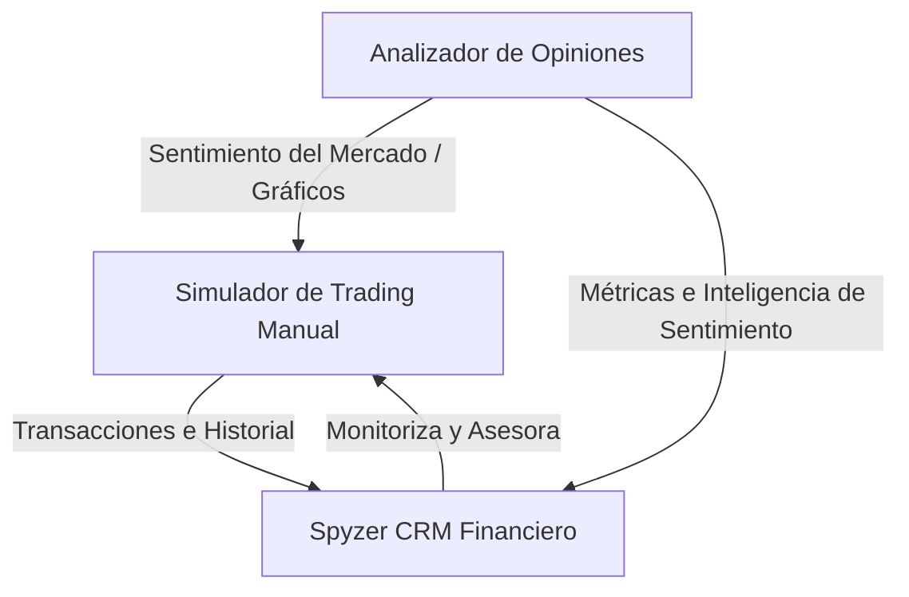

# SPYZER: EL ECOSISTEMA FINANCIERO INTELIGENTE DE PRÓXIMA GENERACIÓN

**Autores:** Miguel Melgarejo, Martín Pappaletera, Alex Boca y Carlos  
**Fecha:** Mayo 2026  

---

## Resumen

Spyzer es una suite fintech integrada y diseñada para transformar radicalmente la forma en que los usuarios, inversores y asesores interactúan con los mercados financieros. En lugar de ofrecer herramientas desconectadas, Spyzer unifica tres pilares en una sola experiencia fluida: un **Simulador de Trading en Tiempo Real** para operar y aprender sin riesgos con saldo virtual en índices como el S&P 500, NASDAQ, IBEX 35 y DAX; un **CRM Financiero** pensado para que los asesores patrimoniales coordinen carteras, hagan seguimiento de clientes y dinamicen sus consultas; y un **Analizador de Opiniones (Sentiment Analyzer)** que procesa flujos de información en redes sociales y noticias financieras mediante lenguaje natural para medir el optimismo o temor colectivo de los inversores.

El motor de la plataforma está construido sobre un backend robusto con **Spring Boot 3.5.6 (Java 21)** que garantiza consistencia transaccional y seguridad sobre **MySQL**. Para eliminar esperas y responder con agilidad a la volatilidad del mercado, el servidor incorpora una capa de caché de alto rendimiento en **Redis** que reduce las consultas de cotizaciones dinámicas a milisegundos. La seguridad se gestiona mediante **Spring Security**, integrando inicio de sesión federado con **Google OAuth2** y autorización persistente basada en tokens **JWT (JSON Web Tokens)**.

La interfaz web del CRM, desarrollada con **React 19**, implementa una arquitectura responsiva que adapta la experiencia desde el menú lateral expandible en escritorio hasta un sistema de cajón lateral (*drawer*) activado mediante hamburguesa en móvil. El módulo CRM Admin Hub está construido sobre **Vite 8** y utiliza **Recharts** para los gráficos financieros, **Framer Motion** para las animaciones y **Lottie React** para los iconos animados del sistema de navegación. Todo ello se rige bajo la guía visual *Spyzer Design System*, caracterizada por una estética oscura premium, efectos de transparencia vidriada (*glassmorphism*) y una paleta semántica de colores donde el azul eléctrico define las acciones primarias, el verde la salud financiera y el rojo las pérdidas o la inactividad.

---

## Abstract

Spyzer is a comprehensive fintech suite designed to transform how users, investors, and financial advisors interact with stock markets. Instead of disconnected utilities, Spyzer integrates three core pillars into a single seamless experience: a **Real-Time Trading Simulator** to trade and learn risk-free with virtual balance on indices such as the S&P 500, NASDAQ, IBEX 35, and DAX; a **Financial CRM** built for wealth advisors to manage client portfolios, track performance, and streamline consultation; and an **Opinion and Sentiment Analyzer** that processes financial news and social media streams using natural language processing to gauge market sentiment.

The platform's engine is powered by an enterprise-grade backend built with **Spring Boot 3.5.6 (Java 21)**, ensuring database transactional consistency and security over **MySQL**. To deliver instant responses in volatile market conditions, the server utilizes a high-speed caching layer with **Redis**, reducing quote retrieval latencies to milliseconds. Backend security is enforced via **Spring Security**, featuring federated single sign-on with **Google OAuth2** and secure request authorization based on self-contained **JWT (JSON Web Tokens)**.

The CRM Admin Hub web client is built on **React 19** with **Vite 8** as the bundler, implementing a collapsible sidebar architecture that adapts smoothly from a full 256px desktop navigation panel to an off-canvas mobile drawer triggered by a hamburger button. Visually, the platform strictly adheres to the *Spyzer Design System* reference guide, featuring a premium dark mode with a "Deep Space" black canvas (#131313), elegant *glassmorphism* transitions through CSS `backdrop-filter` in the scrollable top bar, and animated Lottie icons throughout the navigation that play on hover to reinforce the premium feel of the interface.

---

## 1. La Visión y el Origen de Spyzer

El acceso al mundo de las inversiones suele presentarse como una barrera intimidante y llena de tecnicismos. Para el usuario que empieza, la falta de experiencia práctica y la velocidad de las cotizaciones se traducen casi siempre en pérdidas. Por otra parte, los asesores financieros siguen lidiando con herramientas de gestión obsoletas que no les permiten conectar con sus clientes en tiempo real, mientras que la enorme cantidad de información generada en redes sociales y noticias satura a cualquiera que intente tomar el pulso del mercado de forma manual.

Aquí es donde entra **Spyzer**. La visión de esta plataforma es unificar la simulación, la gestión de clientes y el análisis del sentimiento del mercado en una suite única y coherente. Se asume que la única forma de realizar la transición al trading real con confianza es habiendo entrenado antes en un entorno idéntico, respaldado por datos objetivos y asistencia consultiva en tiempo real. 

Para lograrlo, se desarrolló un motor transaccional seguro y escalable con **Spring Boot 3.5.6** y **Java 21**, capaz de soportar operaciones masivas con absoluta precisión matemática sobre **MySQL**. Aceleramos el acceso a las cotizaciones mediante caché inteligente en **Redis** para esquivar latencias de red, y construimos un cliente en **React 19** que no solo es fluido, sino que enamora a primera vista gracias a un diseño en modo oscuro premium, micro-animaciones y transparencias vidriadas que hacen que la plataforma se sienta viva y moderna.

---

## 2. El Ecosistema Spyzer: Una Suite Financiera Completa

Spyzer no es una aplicación de simulación ordinaria; es una suite integrada por tres módulos que se retroalimentan constantemente para crear una sinergia única.



### 2.1. Spyzer Trading Simulator
El corazón transaccional de la plataforma. Permite a los usuarios operar con saldo virtual en los principales mercados bursátiles bajo condiciones de cotización en tiempo real. El usuario puede realizar operaciones de compra y venta de forma manual de manera ágil, evaluar sus portafolios y configurar alertas de precios personalizadas para reaccionar al instante ante la volatilidad de los índices.

### 2.2. Spyzer CRM (Customer Relationship Management)
Diseñado para que los asesores financieros y gestores de patrimonio coordinen e interactúen con sus clientes. Spyzer CRM centraliza la información financiera en un panel interactivo. Permite a los asesores realizar un seguimiento minucioso del rendimiento de las carteras de sus clientes, sugerir ajustes en sus inversiones simuladas, automatizar informes de rentabilidad periódicos y chatear de manera directa dentro de la plataforma para coordinar estrategias de inversión.

### 2.3. Analizador de Opiniones (Spyzer Sentiment)
Una potente herramienta de escucha activa impulsada por Inteligencia Artificial y Procesamiento de Lenguaje Natural (NLP). Este módulo rastrea de forma constante miles de opiniones en redes sociales (como X/Twitter), blogs financieros e hilos de noticias. Al procesar estos textos, calcula un **Índice de Sentimiento** (optimista o pesimista) para cada activo financiero. Esta métrica se muestra directamente en el frontend mediante gráficos interactivos, permitiendo tanto al usuario como a su asesor tomar decisiones de inversión informadas basadas en el humor colectivo del mercado.

---

## 3. Objetivos del Ecosistema

Para consolidar la suite, se definieron las metas fundamentales que rigen el desarrollo de Spyzer:

| ID | Meta de la Suite | Estrategia de Consecución |
| :--- | :--- | :--- |
| **OBJ-01** | **Trading Realista e Instantáneo** | Sincronización continua de índices mundiales (S&P 500, NASDAQ, IBEX 35, DAX) con soporte visual dinámico e histórico de velas. |
| **OBJ-02** | **Centralización de Clientes (CRM)** | Panel integrado para que asesores financieros monitoricen saldos, posiciones abiertas y recomienden estrategias personalizadas. |
| **OBJ-03** | **Análisis de Sentimiento (Sentiment)** | Captura, análisis y puntuación en tiempo real del optimismo de la red para mostrarlo gráficamente y predecir tendencias. |
| **OBJ-04** | **Sistema de Alertas Dinámicas** | Habilitar la creación y ejecución de disparadores de alertas (PRICE_UP, PRICE_DOWN, etc.) que notifiquen al usuario cuando se cumpla la condición. |
| **OBJ-05** | **Seguridad de Grado Bancario** | Autenticación robusta federada con Google, autorización mediante JWT autocontenidos y protección transaccional ACID en base de datos. |

---

## 4. Arquitectura y Stack Tecnológico

La suite Spyzer se apoya en una infraestructura cliente-servidor robusta, organizada para separar responsabilidades y garantizar tiempos de respuesta inmediatos.

### 4.1. El Cerebro Tecnológico: Spring Boot 3.5.6 & Java 21
El servidor backend gestiona todas las transacciones financieras y algoritmos de la suite en capas independientes:
* **Persistencia y Entidades (JPA/Hibernate):** Mapeo estricto del portafolio, transacciones, alertas y usuarios sobre **MySQL**, garantizando consistencia ACID para que las compras y ventas de los usuarios y asesores sean completamente seguras y libres de colisiones de saldo.
* **Seguridad y JWT:** Autenticación a través de **Spring Security** vinculada a **Google OAuth2** y expedición de tokens **JWT** para que el cliente valide de forma segura cada acción de trading o CRM sin comprometer credenciales.
* **Mitigación de Latencia con Redis:** Las cotizaciones e índices de opinión se guardan en la caché de **Redis** con tiempos de expiración inteligentes, evitando saturar APIs externas y logrando que la aplicación cargue en milisegundos.

---

### 4.2. El Frontend: React 19 y la Arquitectura del CRM Admin Hub

El módulo de interfaz que cubro en esta documentación es el **Spyzer CRM Admin Hub**, la herramienta que los asesores financieros utilizan para gestionar sus clientes, enviar campañas de correo y monitorizar el sentimiento del mercado. Está implementado con **React 19** y empaquetado con **Vite 8**.

#### 4.2.1. Stack de dependencias (versiones exactas del `package.json`)

| Dependencia | Versión | Propósito |
| :--- | :--- | :--- |
| `react` | ^19.2.6 | Motor de renderizado de la interfaz |
| `react-dom` | ^19.2.6 | Montaje del árbol React en el DOM del navegador |
| `react-router-dom` | ^7.15.1 | Enrutamiento SPA con rutas protegidas y públicas |
| `recharts` | ^3.8.1 | Gráficos de área y donut para los paneles del CRM |
| `framer-motion` | ^12.39.0 | Animaciones de entrada, salida y transición de estado |
| `lottie-react` | ^2.4.1 | Iconos animados en formato Lottie JSON para la navegación |
| `lucide-react` | ^1.16.0 | Biblioteca de iconos SVG para la interfaz |
| `clsx` | ^2.1.1 | Composición condicional de clases CSS en componentes |
| `vite` | ^8.0.12 | Bundler de desarrollo ultrarrápido con HMR |
| `@vitejs/plugin-react` | ^6.0.1 | Plugin Vite para Fast Refresh de React |
| `eslint` | ^10.3.0 | Linting estático con reglas específicas para hooks de React |

#### 4.2.2. Configuración del bundler (Vite)

La configuración de Vite (`frontend/vite.config.js`) declara dos decisiones arquitectónicas importantes: el alias `@` que apunta a `./src` para evitar rutas relativas anidadas en los imports, y la apertura automática del navegador en el puerto `5173` al ejecutar `npm run dev`:

```js
// frontend/vite.config.js
import { defineConfig } from 'vite'
import react from '@vitejs/plugin-react'
import path from 'path'

export default defineConfig({
  plugins: [react()],
  resolve: {
    alias: {
      '@': path.resolve(__dirname, './src'),
    },
  },
  server: {
    port: 5173,
    open: true,
  },
})
```

Gracias al alias `@`, todos los imports internos del proyecto prescinden de rutas como `../../components/Card` y se escriben directamente como `@/components/Card/Card`, lo que hace que los archivos sean mucho más fáciles de mover y mantener sin tener que actualizar rutas relativas en cascada.

#### 4.2.3. Punto de entrada y árbol de providers

El punto de entrada en `frontend/src/main.jsx` establece la jerarquía de providers que envuelve toda la aplicación. El orden importa: primero `BrowserRouter` (para que los hooks de Router funcionen en toda la app), luego `AuthProvider` (para que cualquier componente pueda acceder al contexto de autenticación):

```jsx
// frontend/src/main.jsx
createRoot(document.getElementById('root')).render(
  <React.StrictMode>
    <BrowserRouter>
      <AuthProvider>
        <App />
      </AuthProvider>
    </BrowserRouter>
  </React.StrictMode>,
)
```

Los estilos se importan en un orden específico también: primero `reset.css` (para neutralizar los estilos del navegador), luego `tokens.css` (las variables CSS del design system) y finalmente `global.css` (tipografía base y clases utilitarias). Este orden garantiza que las variables ya estén definidas cuando `global.css` las consume.

#### 4.2.4. Sistema de rutas y protección de acceso

El árbol de rutas en `frontend/src/App.jsx` distingue claramente tres categorías: rutas públicas, rutas protegidas con layout, y el fallback de redirección:

```jsx
// frontend/src/App.jsx
function App() {
  return (
    <Routes>
      {/* Rutas públicas */}
      <Route path="/login" element={<Login />} />
      <Route path="/reviews-form" element={<ReviewsForm />} />
      
      {/* Rutas protegidas: verifican JWT antes de renderizar */}
      <Route element={<AuthRoute />}>
        <Route element={<MainLayout />}>
          <Route path="/" element={<Navigate to="/dashboard" replace />} />
          <Route path="/dashboard" element={<Dashboard />} />
          <Route path="/clients" element={<ClientsList />} />
          <Route path="/clients/:id" element={<ClientProfile />} />
          <Route path="/emails" element={<Emails />} />
          <Route path="/reviews" element={<Reviews />} />
        </Route>
      </Route>

      {/* Fallback global */}
      <Route path="*" element={<Navigate to="/dashboard" replace />} />
    </Routes>
  )
}
```

La ruta `/reviews-form` es un caso especial: es una página pública de recogida de valoraciones que el asesor puede enviar como enlace a sus clientes. Al ser pública no pasa por `AuthRoute` ni por `MainLayout`, lo que permite que un cliente externo pueda rellenar una reseña sin necesidad de tener credenciales en la plataforma.

El componente `AuthRoute` (`frontend/src/components/AuthRoute/AuthRoute.jsx`) es el guardián de las rutas privadas. Su implementación es deliberadamente mínima: si `isAuthenticated` es `false`, redirige a `/login`. Si es `true`, renderiza el `<Outlet />` y deja que React Router procese el resto del árbol de rutas hijo:

```jsx
// frontend/src/components/AuthRoute/AuthRoute.jsx
export default function AuthRoute() {
  const { isAuthenticated } = useAuth()
  if (!isAuthenticated) {
    return <Navigate to="/login" replace />
  }
  return <Outlet />
}
```

#### 4.2.5. Layout principal y gestión del sidebar

El componente `MainLayout` (`frontend/src/layouts/MainLayout/MainLayout.jsx`) actúa como el esqueleto visible de todas las páginas protegidas. Mantiene dos estados: `sidebarOpen` (para el panel lateral en móvil) y `sidebarCollapsed` (para el modo compacto en escritorio). Al colapsar el sidebar, el token CSS `--sidebar-width` se sobreescribe a `64px` mediante la clase `.layoutCollapsed`, haciendo que el contenido principal se expanda sin necesidad de JavaScript adicional:

```jsx
// frontend/src/layouts/MainLayout/MainLayout.jsx
export default function MainLayout() {
  const [sidebarOpen, setSidebarOpen] = useState(false)
  const [sidebarCollapsed, setSidebarCollapsed] = useState(false)

  return (
    <div className={`${styles.layout} ${sidebarCollapsed ? styles.layoutCollapsed : ''}`}>
      <Sidebar 
        isOpen={sidebarOpen} 
        onClose={() => setSidebarOpen(false)} 
        isCollapsed={sidebarCollapsed}
        onToggleCollapse={() => setSidebarCollapsed(!sidebarCollapsed)}
      />
      <TopBar onMenuClick={() => setSidebarOpen(!sidebarOpen)} />
      <main className={styles.mainContent}>
        <Outlet />
      </main>
    </div>
  )
}
```

El CSS del layout en `MainLayout.module.css` define el comportamiento responsivo de forma clara: en escritorio el `mainContent` lleva un `margin-left: var(--sidebar-width)` para no quedar tapado por el sidebar; por debajo de `1024px`, ese margen desaparece completamente porque el sidebar pasa a ser un drawer flotante:

```css
/* frontend/src/layouts/MainLayout/MainLayout.module.css */
.mainContent {
  flex: 1;
  margin-left: var(--sidebar-width); /* 256px en desktop */
  margin-top: var(--topbar-height);  /* 64px */
  padding: var(--space-lg);
  transition: margin-left var(--transition-normal);
}

@media (max-width: 1024px) {
  .mainContent {
    margin-left: 0; /* El sidebar flota como overlay */
    padding: var(--space-md);
  }
}

@media (max-width: 640px) {
  .mainContent {
    padding: var(--space-sm);
  }
}
```

#### 4.2.6. Páginas del CRM Admin Hub

| Ruta | Archivo | Descripción |
| :--- | :--- | :--- |
| `/login` | `pages/Login/Login.jsx` | Inicio de sesión con email y contraseña. Formulario con animación wave en los inputs. |
| `/dashboard` | `pages/Dashboard/Dashboard.jsx` | Panel principal con KPIs, gráfico de área de registros, estado de usuarios en radial y actividad reciente paginada. |
| `/clients` | `pages/ClientsList/ClientsList.jsx` | Directorio de clientes con buscador y filtros. |
| `/clients/:id` | `pages/ClientProfile/ClientProfile.jsx` | Perfil detallado de cliente: capital, beneficio, gráfico histórico con selector de período, distribución de cartera y timeline de interacciones. |
| `/emails` | `pages/Emails/Emails.jsx` | Gestor de campañas de correo: composición, selección de plantilla, historial de envíos con colores por rol de destinatario. |
| `/reviews` | `pages/Reviews/Reviews.jsx` | Panel de valoraciones de clientes con métricas de sentimiento IA (positivo/neutro/negativo). |
| `/reviews-form` | `pages/ReviewsForm/ReviewsForm.jsx` | Formulario público de reseña para clientes externos (sin autenticación). |

#### 4.2.7. Modo mock: desarrollo sin backend

El sistema de servicios implementa un patrón de *feature flag* mediante la variable de entorno `VITE_USE_MOCKS`. Por defecto —cuando la variable no está definida en el entorno— el flag se activa automáticamente (`USE_MOCKS = import.meta.env.VITE_USE_MOCKS !== 'false'`), lo que significa que en local el frontend funciona completamente sin backend usando datos estáticos de los archivos en `src/mocks/`. Esto fue una decisión de ingeniería clave: permitir al equipo de frontend iterar sobre la interfaz de forma independiente y en paralelo al desarrollo del backend de Spring Boot, sin bloqueos ni dependencias de red.

Para conectar al backend real basta con establecer `VITE_USE_MOCKS=false` y `VITE_API_URL=http://localhost:8080/api` en el archivo `.env.local` del proyecto.

---

### 4.3. Spyzer Design System: Estética al Servicio de la Finanza

El diseño visual de Spyzer Admin Hub está completamente codificado en dos fuentes de verdad que se complementan: el archivo `DESIGN.md` del repositorio Stitch (que actúa como especificación de diseño) y el archivo `frontend/src/styles/tokens.css` (que lo traduce a variables CSS listas para usar en los componentes).

#### 4.3.1. Filosofía de diseño

El sistema de diseño está concebido para un entorno fintech de alto rendimiento, buscando un equilibrio entre la densidad de información de los terminales Bloomberg profesionales y la claridad moderna de las plataformas de trading minoristas. Se habla de "Precisión Institucional": cada píxel tiene un propósito funcional mientras mantiene una estética premium.

El estilo es **minimalista con un toque glassmórfico**. El modo oscuro profundo reduce la fatiga visual durante sesiones largas de monitoreo. La narrativa visual se centra en la claridad mediante espaciado generoso y una jerarquía de información estricta, para que los movimientos críticos del mercado sean perceptibles de inmediato sin ruido visual.

#### 4.3.2. Paleta de colores completa

La paleta está anclada en un negro "Deep Space" (#131313 como superficie base, #0e0e0e como fondo más profundo) para crear un lienzo oscuro donde los datos destaquen.

```css
/* frontend/src/styles/tokens.css — extracto comentado */
:root {
  /* SUPERFICIES — capas de profundidad por tono */
  --surface:                  #131313;  /* fondo base del body */
  --surface-container-lowest: #0e0e0e;  /* el nivel más profundo */
  --surface-container-low:    #1c1b1b;  /* hover de filas, inputs de tabla */
  --surface-container:        #20201f;  /* dropdowns, menús contextuales */
  --surface-container-high:   #2a2a2a;  /* bordes de cards, grid lines */
  --card-bg:                  #1a1a1a;  /* fondo de todas las tarjetas */
  --card-border:              #2a2a2a;  /* borde de las tarjetas */

  /* TEXTO */
  --on-surface:         #e5e2e1;  /* texto principal */
  --on-surface-variant: #c2c6d7;  /* texto secundario, subtítulos */
  --outline:            #8c90a0;  /* iconos inactivos, metadatos */

  /* PRIMARIO — Azul Eléctrico: acciones, botones, focal points */
  --primary:            #aec6ff;  /* azul claro para texto sobre fondo oscuro */
  --primary-container:  #508dff;  /* azul vibrante para botones, badges activos */

  /* SECUNDARIO — Verde Esmeralda: ganancias, usuarios activos */
  --secondary:          #4edea3;
  --secondary-container:#00a572;
  --gain:               #10b981;  /* variante usada en tablas financieras */

  /* TERCIARIO — Rojo/Coral: pérdidas, errores, inactivos */
  --tertiary:           #ffb3ad;
  --tertiary-container: #ff5451;
  --loss:               #ef4444;  /* variante usada en tablas financieras */

  /* GLOW — efecto de resplandor sobre azul primario */
  --glow-primary:       rgba(47, 127, 255, 0.2);
  --shadow-glow:        0px 4px 24px var(--glow-primary);
}
```

La distinción entre `--gain`/`--loss` y `--secondary`/`--tertiary` es intencionada: `gain` y `loss` son los colores semánticos de datos financieros (tablas de transacciones, variaciones de precio), mientras que `secondary` y `tertiary` son los colores del sistema de diseño para componentes UI (badges, radiales, gráficos de distribución).

#### 4.3.3. Glassmorphism: implementación real

El efecto glassmórfico es visible principalmente en la `TopBar` al hacer scroll. Cuando el usuario desplaza la página más de 10px, el componente añade la clase `scrolled` mediante un event listener, que activa un fondo con `backdrop-filter: blur()`. Este patrón evita el coste de rendimiento de aplicar el blur siempre y lo activa solo cuando tiene sentido visual:

```css
/* frontend/src/components/TopBar/TopBar.module.css */
.topbar {
  position: fixed;
  top: 0;
  background-color: var(--surface);
  border-bottom: 1px solid var(--card-border);
  transition: background-color var(--transition-normal),
              backdrop-filter var(--transition-normal),
              border-color var(--transition-normal);
}

.topbar.scrolled {
  background-color: rgba(19, 19, 19, 0.7);
  backdrop-filter: blur(16px);
  -webkit-backdrop-filter: blur(16px);
  border-color: rgba(42, 42, 42, 0.5);
}
```

De forma similar, las tarjetas del dashboard muestran un resplandor (*glow*) azul eléctrico al pasar el ratón sobre ellas. El componente `Card` implementa la variante `hoverable` que activa `--shadow-glow` en hover:

```css
/* frontend/src/components/Card/Card.module.css */
.card {
  background-color: var(--card-bg);     /* #1a1a1a */
  border: 1px solid var(--card-border); /* #2a2a2a */
  border-radius: var(--rounded-xl);     /* 24px — firma visual del design system */
  padding: var(--space-md);             /* 24px */
}

.cardHoverable:hover {
  box-shadow: var(--shadow-glow); /* 0px 4px 24px rgba(47, 127, 255, 0.2) */
}
```

#### 4.3.4. Tipografía: Inter con figuras tabulares

La única familia tipográfica del sistema es **Inter**, importada desde Google Fonts con los pesos 400, 500, 600 y 700. No se usa ninguna fuente monoespaciada separada; en su lugar, la variante `data-mono` aplica `font-variant-numeric: tabular-nums` sobre Inter para garantizar que las columnas numéricas en tablas financieras se alineen perfectamente:

```css
/* frontend/src/styles/global.css */
.data-mono {
  font-size: var(--data-mono-size);     /* 14px */
  font-weight: var(--data-mono-weight); /* 500 */
  font-variant-numeric: tabular-nums;   /* columnas alineadas en tablas */
}
```

El sistema define escalas tipográficas con nombres semánticos que facilitan la consistencia: `display-lg` (48px/700) para los números KPI más grandes, `headline-sm` (24px/600) para los títulos de sección, `body-md` (15px/400) para el texto corriente, y `label-caps` (11px/600 con `letter-spacing: 0.08em`) para las cabeceras de tablas y etiquetas de sección en mayúsculas.

#### 4.3.5. Espaciado y geometría

El sistema de espaciado usa como unidad base **8px**, siguiendo la convención estándar de los sistemas de diseño modernos. Los valores derivados son: `xs=4px`, `sm=12px`, `md=24px`, `lg=32px`, `xl=48px`. Los corners de las tarjetas principales usan `--rounded-xl` (24px), que da ese aspecto redondeado y suave que es la firma visual del Admin Hub. Los botones e inputs usan `--rounded` (8px) para una sensación más compacta.

#### 4.3.6. Iconos animados: Lottie en la navegación

Una de las decisiones de diseño más llamativas es el uso de **Lottie React** para los iconos de navegación del sidebar. En lugar de iconos SVG estáticos, cada ítem del menú tiene asociado un archivo `.json` de animación Lottie que solo reproduce su ciclo al hacer hover sobre el elemento. Esto da vida al panel de navegación sin resultar agresivo:

```jsx
// frontend/src/components/Sidebar/Sidebar.jsx
function NavItemLink({ item, isCollapsed, onClose }) {
  const lottieRef = useRef(null)

  return (
    <NavLink
      to={item.to}
      onMouseEnter={() => lottieRef.current?.play()}
      onMouseLeave={() => lottieRef.current?.stop()}
    >
      <Lottie
        lottieRef={lottieRef}
        animationData={item.lottieData}
        loop={true}
        autoplay={false}  /* No se reproduce al cargar, solo en hover */
        className={styles.navLottieIcon}
      />
      <span className={styles.navLabel}>{item.label}</span>
    </NavLink>
  )
}
```

Los archivos Lottie están en `frontend/src/assets/lottie/` y cubren: dashboard, client, mail, Review, help, exit, notification, analytics, Order History y Pdf.

#### 4.3.7. Ticker financiero en la TopBar

En la vista de dashboard, la barra superior sustituye el buscador de clientes por un **ticker financiero animado** al estilo Wall Street, construido con el componente `LogoLoop`. Este componente desplaza horizontalmente una fila de cotizaciones en tiempo real (BTC, ETH, SOL, EUR/USD, GBP/USD) con una máscara de degradado en los extremos para crear la ilusión de un scroll infinito:

```jsx
// frontend/src/components/TopBar/TopBar.jsx
{showSearch ? (
  <SearchBar /> // Visible en todas las páginas menos dashboard
) : (
  <div style={{ maskImage: 'linear-gradient(to right, transparent, black 5%, black 95%, transparent)' }}>
    <LogoLoop logos={tickerItems} speed={40} direction="left" hoverSpeed={10} scaleOnHover={true} />
  </div>
)}
```

La lógica para ocultar el buscador en dashboard es deliberada: en esa vista el asesor necesita el espacio para ver las cotizaciones del mercado de un vistazo, mientras que en el resto de páginas el buscador predictivo de clientes es la herramienta principal.

---

### 4.4. Arquitectura y Stack Tecnológico del CRM

El módulo de CRM financiero de Spyzer se implementa como un microservicio independiente construido sobre **Spring Boot 3.5.14** ejecutado bajo **Java 21 (LTS)**, con persistencia exclusiva en **PostgreSQL 16** mediante el driver oficial `org.postgresql.Driver` y el dialecto `org.hibernate.dialect.PostgreSQLDialect`. Esta sección documenta de forma exhaustiva la arquitectura interna, las decisiones de diseño que rigen la capa de persistencia y el catálogo completo de la API REST expuesta al frontend del Admin Hub.

#### A. Infraestructura y Patrón Arquitectónico en Capas

El backend del CRM se estructura siguiendo el patrón canónico de **arquitectura en cuatro capas desacopladas**, donde cada estrato cumple una responsabilidad atómica y unidireccional. El flujo transaccional siempre desciende desde la frontera HTTP hacia la base de datos y asciende reconstruido a través de objetos de transferencia:

| Capa | Paquete | Responsabilidad |
| :--- | :--- | :--- |
| **Controller** | `com.spyzer.crm_backend.controller` | Recepción de peticiones HTTP, validación declarativa (`@Valid`), traducción a DTO de entrada y serialización del DTO de salida. |
| **Service** | `com.spyzer.crm_backend.service[.impl]` | Lógica de negocio, transaccionalidad (`@Transactional`), orquestación de repositorios, cálculo de métricas financieras y aplicación de reglas de dominio. |
| **Repository** | `com.spyzer.crm_backend.repository` | Acceso a datos mediante `JpaRepository<T, ID>` con derivación de métodos por convención de nombres y consultas JPQL puntuales. |
| **Entity** | `com.spyzer.crm_backend.model` | Mapeo objeto-relacional con anotaciones JPA, restricciones de columna y relaciones de integridad referencial. |

El **patrón Data Transfer Object (DTO)** se aplica como medida de **seguridad perimetral**: ningún `Controller` expone instancias de entidades JPA al cliente. Cada operación define un par `*RequestDTO` (entrada validada) y `*ResponseDTO` (proyección de lectura), de forma que campos sensibles como `passwordHash` de la entidad `Administrador` jamás abandonan el límite del servicio. Adicionalmente, esta indirección **previene el problema de recursividad cíclica infinita en la serialización JSON de Hibernate**: la relación bidireccional implícita entre `Usuario` y `ActividadTrading` (`@ManyToOne(fetch = FetchType.LAZY)` en el lado propietario) provocaría un bucle de referencia si Jackson intentara serializar la entidad directamente. Al mapear únicamente los identificadores escalares (`usuarioId`, `usuarioNombreCompleto`) en el `ActividadTradingResponseDTO`, se rompe el ciclo y se garantiza una respuesta JSON acotada y determinista.

#### B. Optimización del Rendimiento N+1

El endpoint `GET /api/usuarios` constituye una de las operaciones de mayor coste computacional del CRM, dado que el frontend lo consume al inicializar la vista `ClientsList.jsx` y requiere mostrar no solo los datos personales del cliente sino también su **capital total** y **beneficio total** consolidados. En una implementación naive, esta vista exigiría desde React **N+1 peticiones HTTP concurrentes** (una al listado y N adicionales al endpoint `/metricas` por cada cliente), saturando la red y degradando el First Contentful Paint.

La solución implementada en `UsuarioServiceImpl.listarTodos()` reestructura el `UsuarioResponseDTO` para **inyectar dinámicamente las propiedades `capitalTotal` y `beneficioTotal` calculadas en el servidor** durante la misma invocación. El servicio precarga la totalidad de las actividades de trading en una única consulta SQL y las agrupa en memoria por `usuario.id` mediante `Collectors.groupingBy`, eliminando el patrón anti-pattern N+1 a nivel de capa de persistencia:

```java
// UsuarioServiceImpl.java:236-242
Map<Long, List<ActividadTrading>> actividadesPorUsuario = actividadTradingRepository.findAll()
        .stream()
        .collect(Collectors.groupingBy(a -> a.getUsuario().getId()));

return usuarios.stream()
        .map(u -> buildDtoEnriquecido(u, actividadesPorUsuario.getOrDefault(u.getId(), List.of()), hace15Dias))
        .collect(Collectors.toList());
```

El método auxiliar `buildDtoEnriquecido` reconstruye en memoria las posiciones netas por instrumento, calcula la liquidez residual a partir del saldo virtual inicial de 50 000,00 USD y materializa `capitalTotal = liquidez + valorAcciones` y `beneficioTotal = ganancia` directamente en el DTO. De este modo, el frontend recibe el listado **pre-hidratado** en una sola petición HTTP y las tablas se renderizan instantáneamente sin necesidad de orquestar peticiones secundarias desde el cliente.

#### C. Diccionario de Datos del Esquema Físico (PostgreSQL)

La base de datos `spyzer_crm` se materializa mediante el generador DDL de Hibernate (`spring.jpa.hibernate.ddl-auto=update`) a partir de las anotaciones JPA del paquete `model`. A continuación se documenta el esquema físico real con tipos de datos PostgreSQL, restricciones y claves foráneas de integridad referencial.

**Tabla `usuarios`** — entidad central del CRM, representa al cliente final del simulador de trading.

| Columna | Tipo PostgreSQL | Restricciones | Propósito |
| :--- | :--- | :--- | :--- |
| `id` | `BIGINT` | `PRIMARY KEY`, `IDENTITY` | Clave primaria autogenerada. |
| `nombre` | `VARCHAR(255)` | `NOT NULL` | Nombre de pila del cliente. |
| `apellido` | `VARCHAR(255)` | `NOT NULL` | Apellido del cliente. |
| `email` | `VARCHAR(255)` | `NOT NULL`, `UNIQUE` | Identificador único de negocio. Validado con `@Email`. |
| `telefono` | `VARCHAR(255)` | — | Teléfono de contacto opcional. |
| `direccion` | `VARCHAR(255)` | — | Dirección postal opcional. |
| `fecha_registro` | `TIMESTAMP` | — | Marca temporal del alta del cliente. |
| `ultima_conexion` | `TIMESTAMP` | — | Última conexión activa, utilizada por el cálculo de segmento. |

**Tabla `actividades_trading`** — libro mayor inmutable de operaciones de compra/venta del simulador.

| Columna | Tipo PostgreSQL | Restricciones | Propósito |
| :--- | :--- | :--- | :--- |
| `id` | `BIGINT` | `PRIMARY KEY`, `IDENTITY` | Identificador secuencial de la operación. |
| `tipo` | `VARCHAR(10)` | `NOT NULL`, `DEFAULT 'COMPRA'` | Discriminador de la operación: `COMPRA` o `VENTA`. |
| `instrumento` | `VARCHAR(255)` | `NOT NULL` | Ticker del activo (ej. `AAPL`, `BTC`, `NVDA`). |
| `cantidad` | `NUMERIC(18,8)` | `NOT NULL` | Volumen operado con precisión de 8 decimales (admite cripto). |
| `precio` | `NUMERIC(18,8)` | `NOT NULL` | Precio unitario en USD en el instante de la operación. |
| `fecha_actividad` | `TIMESTAMP` | `NOT NULL` | Marca temporal del trade. |
| `notas` | `VARCHAR(255)` | — | Comentario libre del asesor. |
| `usuario_id` | `BIGINT` | `NOT NULL`, `FK → usuarios(id)` | Relación `@ManyToOne` propietaria del trade. |

**Tabla `reviews_app`** — valoraciones de la aplicación con análisis de sentimiento posterior por IA.

| Columna | Tipo PostgreSQL | Restricciones | Propósito |
| :--- | :--- | :--- | :--- |
| `id` | `BIGINT` | `PRIMARY KEY`, `IDENTITY` | Identificador de la reseña. |
| `usuario_id` | `BIGINT` | `NOT NULL`, `FK → usuarios(id)` | Autor de la valoración. |
| `calificacion_estrellas` | `INTEGER` | `NOT NULL`, validado `1..5` | Puntuación numérica (`@Min(1) @Max(5)`). |
| `comentario` | `TEXT` | — | Texto libre del usuario sin límite práctico. |
| `sentimiento_ia` | `VARCHAR(255)` | — | Resultado del clasificador externo (POSITIVO/NEUTRO/NEGATIVO). |
| `fecha` | `TIMESTAMP` | `NOT NULL` | Marca temporal del envío. |

**Tabla `campanas_email`** — registro histórico de las campañas de marketing emitidas desde el Admin Hub.

| Columna | Tipo PostgreSQL | Restricciones | Propósito |
| :--- | :--- | :--- | :--- |
| `id` | `BIGINT` | `PRIMARY KEY`, `IDENTITY` | Identificador de la campaña. |
| `publico_objetivo` | `VARCHAR(255)` | `NOT NULL` | Segmento al que se dirige (`ACTIVO`, `VIP`, `INACTIVO`). |
| `asunto` | `VARCHAR(255)` | `NOT NULL` | Subject del correo. |
| `cuerpo` | `TEXT` | `NOT NULL` | Plantilla HTML/texto del correo. |
| `destinatarios` | `TEXT` | — | Lista CSV de emails resueltos en el envío. |
| `fecha_envio` | `TIMESTAMP` | — | Instante real del envío SMTP. |
| `estado` | `VARCHAR(20)` | `NOT NULL` | Enum `BORRADOR \| PROGRAMADA \| ENVIADA`. |

**Tabla `administradores`** — operadores autenticados del CRM (asesores y staff interno).

| Columna | Tipo PostgreSQL | Restricciones | Propósito |
| :--- | :--- | :--- | :--- |
| `id` | `BIGINT` | `PRIMARY KEY`, `IDENTITY` | Identificador del administrador. |
| `nombre` | `VARCHAR(255)` | `NOT NULL` | Nombre del operador. |
| `apellido` | `VARCHAR(255)` | `NOT NULL` | Apellido del operador. |
| `email` | `VARCHAR(255)` | `NOT NULL`, `UNIQUE` | Credencial de login. |
| `password_hash` | `VARCHAR(255)` | `NOT NULL` | Hash BCrypt de la contraseña, nunca expuesto vía DTO. |
| `rol` | `VARCHAR(255)` | `NOT NULL` | Rol funcional (`ADMIN`, `ASESOR`). |
| `fecha_creacion` | `TIMESTAMP` | — | Alta del operador. |

#### D. Mecanismos Avanzados del Motor de Persistencia

La generación de claves primarias se delega al motor mediante `@GeneratedValue(strategy = GenerationType.IDENTITY)`, que en PostgreSQL se traduce internamente a la creación automática de una **`SEQUENCE`** asociada a cada columna `BIGINT`. A diferencia de `GenerationType.SEQUENCE` con `allocationSize` configurable, la estrategia `IDENTITY` apoyada sobre `GENERATED BY DEFAULT AS IDENTITY` garantiza que cada `INSERT` consulte de forma atómica el siguiente valor del *sequence object* a través de una llamada `nextval()` administrada por el propio motor, asegurando la **asignación concurrente y libre de colisiones** de identificadores incluso bajo carga transaccional simultánea proveniente de múltiples sesiones JDBC.

Por su parte, las consultas de los buscadores generales del CRM se apoyan en **índices B-Tree en disco** para evitar el coste de un *Full Table Scan*. PostgreSQL crea automáticamente un índice B-Tree para cada columna marcada con la restricción `UNIQUE`, lo que acelera de forma logarítmica las búsquedas implementadas en `UsuarioRepository`:

```java
// UsuarioRepository.java:14-22
Optional<Usuario> findByEmail(String email);
boolean existsByEmail(String email);
List<Usuario> findByNombreContainingIgnoreCaseOrApellidoContainingIgnoreCase(String nombre, String apellido);
```

Las consultas `findByEmail` y `existsByEmail` resuelven en `O(log n)` gracias al índice implícito sobre `usuarios.email`. La búsqueda predictiva del Admin Hub (`findByNombreContainingIgnoreCase…`) genera una cláusula `LIKE '%query%'` sobre `nombre` y `apellido`, escenario para el cual se documenta como mejora futura la creación de un índice **GIN/`pg_trgm`** que permita aceleración de coincidencias parciales sin recurrir a un escaneo secuencial completo de la relación.

#### E. Catálogo e Inventario de la API REST del CRM

La siguiente tabla enumera de forma exhaustiva el conjunto de endpoints HTTP expuestos por el backend del CRM, extraídos directamente de las anotaciones `@RequestMapping` de los controladores en `src/main/java/com/spyzer/crm_backend/controller/`. Todos los endpoints están protegidos por el filtro `JwtAuthFilter` salvo el flujo público de autenticación.

| Método | Ruta Completa | Parámetros de entrada | DTO de respuesta | Propósito funcional |
| :--- | :--- | :--- | :--- | :--- |
| POST | `/api/auth/register` | `@RequestBody AdminRegistroRequestDTO` | `AdminResponseDTO` | Alta de un nuevo operador del CRM con BCrypt y rol asignado. |
| POST | `/api/auth/login` | `@RequestBody LoginRequestDTO` | `LoginResponseDTO` | Autenticación de administrador; devuelve token JWT firmado en HS256. |
| GET | `/api/usuarios` | — | `List<UsuarioResponseDTO>` | Listado pre-hidratado de clientes con `capitalTotal` y `beneficioTotal` calculados. |
| GET | `/api/usuarios/buscar` | `@RequestParam("query") String` | `List<UsuarioResponseDTO>` | Buscador predictivo por nombre/apellido del Admin Hub. |
| POST | `/api/usuarios` | `@RequestBody UsuarioRequestDTO` | `UsuarioResponseDTO` (201) | Registro de un cliente nuevo desde el CRM. |
| PUT | `/api/usuarios/{id}` | `@PathVariable Long id`, `@RequestBody UsuarioRequestDTO` | `UsuarioResponseDTO` | Actualización de datos personales del cliente (modal `EditUserModal`). |
| GET | `/api/usuarios/{id}` | `@PathVariable Long id` | `UsuarioResponseDTO` | Recuperación completa del perfil para `ClientProfile.jsx`. |
| GET | `/api/usuarios/email/{email}` | `@PathVariable String email` | `UsuarioResponseDTO` | Búsqueda alternativa por email único. |
| PATCH | `/api/usuarios/{id}/ultima-conexion` | `@PathVariable Long id` | `UsuarioResponseDTO` | Actualiza `ultima_conexion` para el cálculo de segmento. |
| POST | `/api/usuarios/{id}/segmentos/procesar` | `@PathVariable Long id` | `UsuarioResponseDTO` | Recalcula y devuelve el segmento (`INACTIVO`/`ACTIVO`/`VIP`). |
| GET | `/api/usuarios/{id}/actividades` | `@PathVariable Long id` | `List<ActividadRecienteDTO>` | Timeline combinado de operaciones de trading y correos recibidos. |
| GET | `/api/usuarios/{id}/metricas` | `@PathVariable Long id` | `MetricasFinancierasDTO` | KPIs financieros: invertido, liquidez, valor cartera, P&L, distribución. |
| GET | `/api/usuarios/{id}/historial-capital` | `@PathVariable Long id`, `@RequestParam(defaultValue="6M") String period` | `List<HistorialCapitalDTO>` | Serie temporal del capital total por período (`1M`, `3M`, `6M`, `1Y`). |
| GET | `/api/usuarios/{id}/export-pdf` | `@PathVariable Long id` | `byte[]` (`application/pdf`) | Ficha PDF del cliente generada con OpenPDF 1.3.30. |
| POST | `/api/actividades` | `@RequestBody ActividadTradingRequestDTO` | `ActividadTradingResponseDTO` (201) | Registra una operación `COMPRA`/`VENTA` con validación financiera. |
| GET | `/api/campanas` | — | `List<CampanaEmailResponseDTO>` | Histórico de campañas de email del módulo de marketing. |
| POST | `/api/campanas` | `@RequestBody CampanaEmailRequestDTO` | `CampanaEmailResponseDTO` (201) | Creación y envío SMTP de una campaña al segmento objetivo. |
| GET | `/api/campanas/plantillas` | — | `List<Map<String,String>>` | Plantillas predefinidas (Bienvenida, Reactivación, VIP). |
| POST | `/api/reviews` | `@RequestBody ReviewAppRequestDTO` | `ReviewAppResponseDTO` (201) | Registro de reseña pública desde `ReviewsForm.jsx`. |
| GET | `/api/reviews` | — | `List<ReviewAppResponseDTO>` | Listado de valoraciones para el panel `Reviews.jsx`. |
| PATCH | `/api/reviews/{id}/analisis` | `@PathVariable Long id`, `@RequestBody AnalisisIaRequestDTO` | `ReviewAppResponseDTO` | Inserta el resultado del clasificador IA externo. |
| GET | `/api/stats/actividades/ultimas-24h` | — | `ResumenActividad24hDTO` | Resumen de operaciones de las últimas 24 horas. |
| GET | `/api/stats/usuarios/por-mes` | — | `List<RegistroMensualDTO>` | Agregación de registros agrupados por año/mes vía JPQL. |
| GET | `/api/stats/actividad-reciente` | — | `List<ActividadRecienteDTO>` | Feed de eventos recientes para el dashboard. |
| GET | `/api/stats/instrumentos` | — | `Map<String, BigDecimal>` | Catálogo de instrumentos con precio de referencia. |
| GET | `/api/stats/kpis` | — | `KpisDashboardDTO` | KPIs agregados de la plataforma (usuarios, operaciones, volumen). |
| GET | `/api/stats/reviews` | — | `ReviewsEstadisticasDTO` | Nota promedio y desglose por sentimiento de IA. |
| GET | `/api/stats/export` | — | `byte[]` (`application/pdf`) | Exporta el informe consolidado del dashboard como PDF. |

---

> **4.5. Arquitectura e Integración del Analizador de Opiniones**
> 
> **[ZONA DE COLABORACIÓN: SECCIÓN RESERVADA PARA EL DESARROLLO DEL ANALIZADOR DE SENTIMIENTO]**  
> *Instrucciones para el redactor encargado:*  
> * En esta sección debes detallar la ingeniería detrás del analizador de opiniones (Sentiment Analyzer).
> * Explica el mecanismo de captura de información (scrapers, APIs de redes sociales o streams de noticias), el modelo de lenguaje o biblioteca NLP utilizada para la clasificación de sentimiento (Positivo / Negativo / Neutro).
> * Detalla cómo se integran las puntuaciones calculadas con la caché de Redis y los controladores de Spring Boot para exponer las series temporales de sentimiento representadas en los gráficos de Recharts.
> 
> *--- Elimina esta guía una vez redactado tu contenido ---*

---

## 5. Desafíos Técnicos Resueltos

Poner en marcha una suite fintech de estas dimensiones planteó retos tecnológicos de alta complejidad:

1. **La consistencia de las Transacciones Financieras en Tiempo Real:** En un simulador financiero de alta frecuencia, cada operación debe ejecutarse de forma atómica. Se diseñó un servicio que, bajo transacciones aisladas, verifica el saldo disponible del usuario, realiza la simulación del trade a precio actual y liquida y actualiza en un solo paso la base de datos MySQL, registrando el movimiento en el historial.
2. **Agregación y Procesamiento de Opiniones (Sentiment) sin Bloqueos:** El analizador de opiniones procesa constantemente streams de texto de redes sociales. Para evitar cuellos de botella en el servidor principal, el análisis NLP y el cálculo del Índice de Sentimiento se procesan en tareas asíncronas desacopladas del flujo transaccional principal, guardando la puntuación calculada en Redis para que el motor de visualización de gráficos pueda consultarlo al instante sin latencia.
3. **Coordinación CRM-Simulador:** El CRM necesita actualizar el valor patrimonial de los clientes en tiempo real. En lugar de realizar consultas continuas e ineficientes a la base de datos, el CRM aprovecha las cotizaciones calientes de la caché de Redis para calcular al vuelo el valor de mercado actual de todas las posiciones de la cartera del cliente cuando el asesor accede al panel.
4. **Desarrollo Frontend Desacoplado del Backend:** Mantener el ritmo de iteración del frontend sin bloquear su avance esperando que cada endpoint del backend estuviera disponible fue un reto real de coordinación. La solución fue implementar un sistema de mocks activable por variable de entorno (`VITE_USE_MOCKS`). Cada servicio evalúa el flag en tiempo de ejecución y desvía las peticiones a datos estáticos. Esto permitió que la interfaz visual y la lógica de integración se desarrollaran en paralelo, acortando considerablemente los tiempos de entrega de cada iteración.
5. **Consistencia Numérica Internacional en la Interfaz:** Al integrar los datos reales del backend, se detectó que los valores numéricos se mostraban sin decimales o con el separador incorrecto en algunos contextos. La solución fue estandarizar toda la presentación de valores monetarios mediante `Intl.NumberFormat('es-ES', { minimumFractionDigits: 2, maximumFractionDigits: 2 })` tanto en los componentes de la interfaz como en el mapeo de las respuestas de los servicios, garantizando que un valor como `50000.5` siempre se muestre como `50.000,50` independientemente del contexto.

---

## 6. Casos de Uso del Ecosistema

A continuación se detallan los principales flujos y casos de uso interactivos de la suite, expuestos bajo el formato de tabla formal del documento de referencia.

### RF-01: Registro e Inicio de Sesión de Usuario (Google OAuth2)

| Campo | Detalle |
| :--- | :--- |
| **Objetivos asociados** | **OBJ-05** (Seguridad de Grado Bancario) |
| **Descripción** | El sistema registra de manera ágil y segura al usuario usando su cuenta de Google, inicializando su saldo virtual de simulación por defecto. |
| **Precondición** | El usuario no debe estar autenticado en la plataforma y debe contar con una cuenta de Google activa. |
| **Secuencia Normal** | **1.** El usuario entra a la Landing Page y pulsa en "Iniciar sesión con Google".<br>**2.** El frontend redirige al flujo seguro de Google OAuth2.<br>**3.** El usuario introduce sus credenciales en Google y concede los permisos de perfil.<br>**4.** Google devuelve un código de acceso redireccionado de forma segura al endpoint del backend.<br>**5.** El backend procesa el código, crea el registro en la tabla de usuarios si es la primera vez (inicializando su balance de simulación en $50,000.00) y genera el token JWT.<br>**6.** El frontend recibe la respuesta JSON con `{ token, nombre, rol, email }`, almacena el JWT en `localStorage` bajo la clave `spyzer_token` y los datos del usuario bajo `spyzer_user`, actualiza el estado global de `AuthContext` y redirige automáticamente a `/dashboard`. |
| **Postcondición** | El usuario cuenta con una sesión iniciada segura y tiene acceso inmediato a todas las funciones de la suite. |
| **Excepciones** | **Paso 3:** Si el usuario cancela la autenticación en Google, el sistema aborta el flujo y lo devuelve a la Landing Page informando del suceso. |
| **Implementación Frontend** | El flujo de login en el CRM Admin Hub pasa por `Login.jsx` → `useAuth().login()` → `authService.login()` → POST `/api/auth/login`. El `AuthContext` persiste la sesión en `localStorage` y la expone globalmente. `AuthRoute.jsx` protege el árbol de rutas privadas y redirige a `/login` si `isAuthenticated === false`. |

---

### RF-02: Consulta de Datos de Mercado y Sentimiento

| Campo | Detalle |
| :--- | :--- |
| **Objetivos asociados** | **OBJ-01** (Trading Realista), **OBJ-03** (Análisis de Sentimiento) |
| **Descripción** | El usuario visualiza la cotización bursátil actual junto al gráfico interactivo del Índice de Sentimiento derivado del análisis de opiniones. |
| **Precondición** | El usuario debe estar autenticado con sesión activa (JWT válido). |
| **Secuencia Normal** | **1.** El usuario entra a la sección de "Trading".<br>**2.** El frontend realiza una petición HTTP GET al endpoint `/api/market-data/{symbol}` pasando el JWT.<br>**3.** El backend busca el precio actual del activo y su Índice de Sentimiento en la caché de Redis.<br>**4.** Si los datos no están en caché, el backend los recupera de la API de mercado y del agregador de opiniones, actualiza Redis y responde al cliente.<br>**5.** El frontend recibe el JSON consolidado.<br>**6.** React dibuja de forma interactiva el gráfico de velas con `lightweight-charts` y el gráfico de sentimiento social con `recharts`. |
| **Postcondición** | El usuario visualiza el estado financiero del activo y la opinión pública en tiempo real sobre el mismo. |
| **Excepciones** | **Paso 4:** Si falla el canal de mercado externo, el sistema utiliza los últimos datos guardados de forma persistente y avisa en pantalla que se muestran datos históricos recientes. |

---

### RF-03: Operación de Compra (Trading Simulator)

| Campo | Detalle |
| :--- | :--- |
| **Objetivos asociados** | **OBJ-01**, **OBJ-05** |
| **Descripción** | Permite al usuario comprar participaciones de índices/acciones utilizando el balance de su cuenta simulada. |
| **Precondición** | El usuario debe poseer saldo suficiente en su `balanceActual` para cubrir el importe de la operación al precio actual. |
| **Secuencia Normal** | **1.** En el panel de trading, el usuario ingresa la cantidad de títulos y pulsa en "Comprar".<br>**2.** El frontend valida que la cantidad sea correcta y envía una petición POST a `/api/trading/buy`.<br>**3.** El backend abre una transacción aislada, comprueba que el saldo del usuario cubra la compra al precio del mercado.<br>**4.** Descuenta el total del `balanceActual` del usuario.<br>**5.** Crea o actualiza la posición en `portfolio`, recalculando de forma automática el precio medio de compra.<br>**6.** Registra el movimiento en `transactions` con tipo `BUY` e historial correspondiente.<br>**7.** El servidor confirma el éxito de la compra y actualiza los balances del portafolio en el frontend. |
| **Postcondición** | Se añade la posición al portafolio del usuario, se descuenta el saldo correspondiente de su balance y se registra en su historial. |
| **Excepciones** | **Paso 3:** Si el costo de la operación supera el saldo del balance del usuario, la transacción se revierte (Rollback) y se devuelve un error HTTP 400 "Saldo insuficiente para la compra". |

---

### RF-04: Operación de Venta (Trading Simulator)

| Campo | Detalle |
| :--- | :--- |
| **Objetivos asociados** | **OBJ-01**, **OBJ-05** |
| **Descripción** | Permite liquidar posiciones de activos existentes para obtener ganancias o asumir pérdidas simuladas. |
| **Precondición** | El usuario debe disponer de una posición abierta del activo en su `portfolio` con cantidad suficiente para la venta. |
| **Secuencia Normal** | **1.** El usuario indica la cantidad a vender del activo y hace clic en "Vender".<br>**2.** El frontend transmite la orden vía POST al endpoint `/api/trading/sell`.<br>**3.** El backend inicia una transacción controlada y verifica que la cantidad a vender no supere los títulos del portafolio del usuario.<br>**4.** Resta los títulos de la posición de portafolio y, si la cantidad restante llega a cero, elimina la fila de la tabla `portfolio`.<br>**5.** Calcula el importe obtenido de la venta (`cantidad * precio_actual`) y lo suma al `balanceActual` del usuario.<br>**6.** Genera el registro de la transacción en MySQL como tipo `SELL` en el historial.<br>**7.** Confirma al cliente React el éxito de la venta para actualizar los saldos en pantalla. |
| **Postcondición** | Se reduce o elimina la posición del portafolio, se suma el saldo líquido obtenido al balance del usuario y se archiva en transacciones. |
| **Excepciones** | **Paso 3:** Si el usuario intenta vender una cantidad mayor a la que dispone en cartera, se aborta la venta y el backend responde con error de validación. |

---

### RF-05: Monitorización de Clientes en CRM Financiero

| Campo | Detalle |
| :--- | :--- |
| **Objetivos asociados** | **OBJ-02** (Gestión de Portafolio), **OBJ-05** |
| **Descripción** | Un asesor financiero consulta la evolución del portafolio y los rendimientos agregados de un cliente asignado en el CRM. |
| **Precondición** | El asesor debe disponer de credenciales válidas y el usuario analizado debe estar vinculado a su cartera de clientes. |
| **Secuencia Normal** | **1.** El asesor accede a la pestaña "Clientes" desde el sidebar del Admin Hub.<br>**2.** `ClientsList.jsx` hace GET a `/api/usuarios` a través de `clientService.getClients()`. La respuesta mapea `estadoUsuario` a `accountStatus` ('Active'/'Inactive'/'VIP') y `capitalTotal` al campo normalizado `totalCapitalInvested`.<br>**3.** El asesor localiza al cliente con el buscador predictivo de la `TopBar` (busca por nombre, apellido o email en tiempo real) y hace clic en su fila.<br>**4.** `ClientProfile.jsx` recibe el `id` del cliente vía `useParams()` y lanza tres peticiones paralelas: GET `/api/usuarios/:id`, GET `/api/usuarios/:id/metricas` y GET `/api/usuarios/:id/actividades`.<br>**5.** Las métricas (`distribucionCarteraPorcentaje`, `gananciaPerdida`, `liquidezActual`) se mapean a la estructura de gráficos. El historial de actividades se transforma en el timeline de interacciones.<br>**6.** `Recharts` renderiza el gráfico de área de evolución de capital con selector de período (1D, 1S, 1M, 6M, 1A, ALL). |
| **Postcondición** | El asesor financiero visualiza con precisión el rendimiento patrimonial de su cliente para formular recomendaciones tácticas de inversión. |
| **Excepciones** | **Paso 4:** Si alguna de las peticiones falla, los catch individuales devuelven `null` o `[]` y el componente renderiza el resto de la información sin romperse. Si el asesor intenta consultar un ID de cliente sin acceso, Spring Security bloquea la petición devolviendo HTTP 403. |

---

### RF-06: Creación y Gestión de Alertas de Precios

| Campo | Detalle |
| :--- | :--- |
| **Objetivos asociados** | **OBJ-04** (Sistema de Alertas Dinámicas) |
| **Descripción** | El usuario programa alertas automáticas para que el sistema avise en pantalla si un activo cruza cierto valor límite. |
| **Precondición** | El usuario debe estar autenticado en la plataforma. |
| **Secuencia Normal** | **1.** El usuario entra al apartado "Mis Alertas" en el menú superior.<br>**2.** Rellena el formulario indicando el activo, el tipo de condición (`PRICE_UP` o `PRICE_DOWN`), el precio de trigger y un mensaje personalizado opcional.<br>**3.** Pulsa en "Crear Alerta" y el frontend envía los datos vía POST a `/api/alerts`.<br>**4.** El backend registra la alerta en MySQL en estado activa y sin disparar.<br>**5.** El frontend recibe la confirmación y refresca el listado dinámico de alertas activas, permitiendo pausarlas o borrarlas con un clic. |
| **Postcondición** | La alerta queda persistida y activa en el servidor, lista para ser evaluada contra los flujos de mercado. |
| **Excepciones** | **Paso 3:** Si se ingresa un precio de trigger igual o inferior a cero, el backend rechaza la creación y el frontend solicita corregir el campo de precio. |

---

### RF-07: Consulta y Gestión del Historial de Transacciones

| Campo | Detalle |
| :--- | :--- |
| **Objetivos asociados** | **OBJ-02** (Gestión de Portafolio), **OBJ-05** |
| **Descripción** | El usuario o su asesor financiero consultan el historial completo de operaciones de compra y venta realizadas para realizar auditorías o analizar rentabilidad. |
| **Precondición** | El usuario debe estar autenticado o disponer de permisos de asesor en el CRM para consultar dicho historial. |
| **Secuencia Normal** | **1.** El asesor accede al perfil de un cliente en `/clients/:id`.<br>**2.** El componente `ClientProfile.jsx` carga automáticamente el historial de actividades desde `/api/usuarios/:id/actividades`.<br>**3.** El backend autentica la petición vía JWT e intercepta en el header `Authorization: Bearer {token}` a través del helper `request()` en `api.js`.<br>**4.** Las actividades recibidas (tipo `TRADING`, `EMAIL`, `REVIEW`) se mapean a entradas del timeline con título traducido, fecha localizada (`toLocaleDateString('es-ES')`) y descripción con valores numéricos formateados a `es-ES`.<br>**5.** El timeline se renderiza en orden cronológico inverso, mostrando compras, ventas y eventos de registro de cuenta. |
| **Postcondición** | El asesor obtiene una visión clara e inalterable de todos los movimientos históricos del cliente. |
| **Excepciones** | **Paso 2:** Si la petición a `/actividades` falla, el `.catch(() => [])` devuelve un array vacío y el timeline simplemente no muestra entradas, sin crashear la vista. |

---

### RF-08: Gestión de Campañas de Email (CRM)

| Campo | Detalle |
| :--- | :--- |
| **Objetivos asociados** | **OBJ-02** (CRM), **OBJ-03** (Análisis de Sentimiento) |
| **Descripción** | El asesor financiero redacta y envía campañas de correo masivas a segmentos de clientes desde el módulo Emails del Admin Hub. |
| **Precondición** | El asesor debe estar autenticado de forma activa en el panel CRM. |
| **Secuencia Normal** | **1.** El asesor accede a "Envío correos" desde el sidebar.<br>**2.** `Emails.jsx` carga las plantillas disponibles vía `emailService.getEmailTemplates()` → GET `/api/campanas/plantillas`.<br>**3.** El asesor selecciona una plantilla (que incluye un enlace CTA de reseña generado automáticamente), configura el asunto, selecciona el rol de los destinatarios (con colores diferenciados: blanco=base, verde=activos, azul=VIP, rojo=inactivos) y pulsa enviar.<br>**4.** El frontend envía la campaña vía POST a `/api/campanas` con `emailService.sendCampaign()`.<br>**5.** El historial de campañas se actualiza en la vista mostrando el estado (`SENT`, `PENDING`) y el número de destinatarios. |
| **Postcondición** | La campaña queda registrada en el backend y se envía a los destinatarios del segmento seleccionado. |
| **Excepciones** | Si el canal SMTP falla momentáneamente, el backend gestiona la cola de envío y el frontend muestra el estado `PENDING` hasta la confirmación. |

---

### RF-09: Recepción de Notificaciones de Triggers en Tiempo Real

| Campo | Detalle |
| :--- | :--- |
| **Objetivos asociados** | **OBJ-04** (Sistema de Alertas Dinámicas) |
| **Descripción** | El sistema procesa las cotizaciones actuales y notifica de inmediato al usuario en pantalla cuando una de sus alertas salta. |
| **Precondición** | El usuario debe tener al menos una alerta registrada como activa. |
| **Secuencia Normal** | **1.** El programador de Spring Boot recupera de forma continua los precios de los activos bursátiles.<br>**2.** El servicio de alertas evalúa las alertas activas de la base de datos contra el último precio.<br>**3.** Si el precio cruza el trigger de una alerta (ej. sube del precio límite configurado para `PRICE_UP`), el backend invoca al método `disparar()`, inactiva la alerta y genera un registro de notificación.<br>**4.** Si el usuario está online, el cliente React recibe la notificación instantánea en pantalla mostrando un Toast animado con el mensaje personalizado y el precio exacto del disparo. En la `TopBar`, el botón de notificaciones utiliza un Lottie animado que se reproduce al hacer hover, proveyendo feedback inmediato visual.<br>**5.** El usuario puede pulsar en la notificación para abrir directamente el gráfico del activo. |
| **Postcondición** | La alerta se marca como disparada e inactiva, y el usuario recibe el aviso en tiempo real. |
| **Excepciones** | Si el usuario está sin conexión cuando la alerta se activa en servidor, la notificación queda marcada como pendiente y se le entrega inmediatamente al iniciar sesión de nuevo en la plataforma. |

---

### RF-10: Cierre de Sesión Seguro

| Campo | Detalle |
| :--- | :--- |
| **Objetivos asociados** | **OBJ-05** (Seguridad de Grado Bancario) |
| **Descripción** | El usuario cierra su sesión de forma limpia, borrando sus claves de autorización del navegador. |
| **Precondición** | El usuario debe estar autenticado con sesión activa. |
| **Secuencia Normal** | **1.** El usuario pulsa en "Cerrar sesión" en la parte inferior del sidebar.<br>**2.** El sidebar llama a `handleLogout()`, que ejecuta `logout()` del `AuthContext` y redirige a `/login` con `navigate()`.<br>**3.** `logout()` en `AuthContext.jsx` elimina `spyzer_user` y `spyzer_token` de `localStorage`, y establece `user = null` y `token = null` en el estado React.<br>**4.** Al actualizarse `isAuthenticated` a `false`, `AuthRoute` redirige automáticamente cualquier intento de acceso a rutas protegidas de vuelta a `/login`.<br>**5.** El navegador muestra el formulario de login con el estado limpio. |
| **Postcondición** | La sesión queda destruida en el cliente, haciendo imposible acceder a los paneles privados del usuario sin iniciar sesión de nuevo. |
| **Excepciones** | Si ocurre un fallo en el borrado de las variables del navegador, el frontend fuerza una recarga total de la pestaña redirigiendo a la Landing Page. |

---

## 7. Experiencia de Usuario Responsiva: Mobile vs Desktop

El CRM Admin Hub implementa una estrategia de adaptación responsiva basada en **un sidebar colapsable** en lugar de un árbol de componentes completamente bifurcado. La decisión es pragmática: dado que el CRM es una herramienta profesional de asesoramiento que se usa principalmente en escritorio, el esfuerzo se concentró en hacer la experiencia de escritorio impecable y garantizar que la de móvil sea usable y fluida, no en construir dos interfaces paralelas completas.

### 7.1. Comportamiento del Sidebar por Tamaño de Pantalla

La adaptación responsiva pivota sobre el sidebar y el `MainLayout`:

**Desktop (> 1024px):**
- El sidebar está siempre visible, anclado a la izquierda con `position: fixed`, 256px de ancho por defecto.
- El botón de toggle (☰) lo colapsa a 64px, mostrando solo los iconos Lottie sin etiquetas. Al pasar el ratón sobre un ítem colapsado aparece el `title` con el nombre via atributo HTML nativo.
- El `mainContent` usa `margin-left: var(--sidebar-width)` con transición suave al colapsar.
- La TopBar muestra el ticker financiero en dashboard y el buscador predictivo en el resto de vistas.

**Tablet / Mobile (≤ 1024px):**
- El sidebar sale completamente del flujo del documento (el `mainContent` tiene `margin-left: 0`).
- El botón ☰ en la `TopBar` abre el sidebar como un panel flotante (*drawer*) sobre el contenido.
- Un overlay semitransparente (`styles.overlay`) cubre el resto de la pantalla. Hacer clic sobre él cierra el drawer.
- Las páginas se muestran en una sola columna con padding reducido (`var(--space-md)` en tablet, `var(--space-sm)` en móvil).

### 7.2. Vista de Desktop: El Panel de Control del Asesor

En escritorio, el Dashboard ofrece la experiencia más completa:

- **KPIs en cuadrícula de 4 columnas:** Las tarjetas de Usuarios Totales, Registros del Último Mes, Correos Enviados e Usuarios Inactivos se muestran en una fila con sus métricas de cambio porcentual respecto al mes anterior y su indicador de tendencia (↑/↓).
- **Gráfico de registros con períodos:** Un `AreaChart` de `recharts` con gradiente de azul primario muestra la evolución de registros en el período seleccionado (1D, 1S, 1M, 6M, 1A, ALL). La lógica de agrupación temporal se calcula reactivamente en el cliente a partir de los datos reales de `fechaRegistro` de los usuarios.
- **RadialProgress de estado de usuarios:** Tres anillos concéntricos visualizan la distribución de usuarios Inactivos (rojo/`--loss`), Activos (verde/`--gain`) y VIP (azul/`--primary-container`).
- **Ticker de mercado en la TopBar:** BTC, ETH, SOL, EUR/USD y GBP/USD desfilan horizontalmente con variaciones de precio codificadas por color.
- **SlideButton para exportar PDF:** En lugar de un botón convencional, la exportación del dashboard se activa mediante un slider que el usuario arrastra hasta el final, con animación Lottie integrada. Esto reduce exportaciones accidentales.

En el perfil de cliente (`/clients/:id`), el asesor tiene:
- Cabecera con datos personales (nombre, email, teléfono, ubicación, fecha de registro) e indicador de estado con badge de color.
- Tres métricas financieras clave: inversión inicial, valor total actual y beneficio/pérdida acumulado.
- Gráfico de área histórico de la evolución de capital con selector de período (1D/1S/1M/6M/1A/ALL).
- Timeline cronológico de todas las interacciones: operaciones de trading (COMPRA/VENTA), campañas de email recibidas y fecha de registro de cuenta.
- Modal de edición de datos del cliente (`EditUserModal`) para actualizar información personal.

### 7.3. Vista de Móvil: Operatividad en Movimiento

En dispositivos móviles, la experiencia se adapta así:

- **Navegación:** El sidebar está oculto. El botón ☰ en la esquina superior izquierda de la TopBar lo despliega como panel lateral con un overlay que lo cierra al tocar fuera.
- **Dashboard:** Las 4 tarjetas KPI pasan a disposición vertical (una columna). El gráfico de registros y el RadialProgress se apilan verticalmente.
- **Lista de clientes:** La tabla del directorio se convierte en una lista de tarjetas con los datos más relevantes de cada cliente.
- **Perfil de cliente:** Las secciones de métricas, gráfico e historial se muestran en scroll vertical continuo.
- **Buscador:** El buscador predictivo de la TopBar mantiene toda su funcionalidad en móvil, incluyendo el dropdown de resultados.

---

## 8. Verificación, Pruebas y Monitorización

### 8.1. Pruebas de Integración y Transaccionalidad
La fiabilidad se valida de la suite a través de rigurosas fases de pruebas automatizadas y de estrés:
* **Consistencia de Transacciones:** Verificamos bajo concurrencia extrema de peticiones simultáneas de usuarios que el balance del portafolio nunca sufra duplicaciones o inconsistencias numéricas.
* **Tests de Integración en Backend:** Empleamos MockMVC en Spring Boot para testear los flujos de seguridad y autenticación OAuth2, garantizando que el middleware de JWT responda siempre adecuadamente ante tokens manipulados o vencidos.

### 8.2. Monitorización en Vivo (Actuator)
Para garantizar la continuidad operativa de la suite, se utiliza **Spring Boot Actuator** configurado para vigilar los componentes en producción:
* Salud de la persistencia transaccional en MySQL.
* Latencia en tiempo real y tasa de respuesta de la caché caliente en Redis.

---

### 8.3. Plan de Pruebas del Módulo CRM

El plan de control de calidad del módulo CRM se articula sobre el binomio **JUnit 5 (Jupiter)** y **Mockito** —ambos provistos transitivamente por la dependencia `spring-boot-starter-test`— complementado con `AssertJ` para aserciones fluidas y `MockMvc` para los flujos de integración HTTP. Las pruebas se ejecutan mediante `mvn test` y se organizan por la responsabilidad concreta que auditan: lógica financiera, consistencia de cartera y seguridad de la migración inicial de datos.

#### A. Tests de Blindaje Lógico Financiero

El primer bloque audita el método transaccional `ActividadTradingServiceImpl.registrarOperacion(...)` para garantizar que ninguna operación de **`COMPRA`** consiga generar liquidez negativa en la cuenta del cliente. La regla de negocio bajo escrutinio está implementada en `ActividadTradingServiceImpl.java:42-47`, donde el servicio calcula el coste total de la transacción como `cantidad × precio` y lo coteja contra la `liquidezActual` obtenida del método `usuarioService.calcularMetricas(usuarioId)`:

```java
if ("COMPRA".equals(tipo)) {
    BigDecimal costTotal = dto.getCantidad().multiply(precio);
    if (costTotal.compareTo(metricas.getLiquidezActual()) > 0) {
        throw new IllegalArgumentException(
                "Saldo insuficiente. No tienes liquidez para realizar esta compra");
    }
}
```

El test unitario correspondiente, redactado bajo el patrón **Arrange-Act-Assert**, mockea `UsuarioRepository` para devolver un cliente con `liquidezActual = 100,00 USD` y simula una orden de compra de 5 unidades de `AAPL` a un precio inyectado en `PRECIOS_ACTUALES` que produce un coste superior. La aserción verifica que el método detenga la transacción lanzando un `IllegalArgumentException` controlado (no una excepción genérica de Hibernate) y, mediante `verify(actividadTradingRepository, never()).save(any())`, confirma que **no se haya persistido ninguna fila en `actividades_trading`**, garantizando que el rollback se aplique antes de tocar la base de datos:

```java
@Test
void registrarOperacion_compraConSaldoInsuficiente_lanzaIllegalArgumentException() {
    // Arrange — cliente con liquidez insuficiente
    when(usuarioRepository.findById(1L)).thenReturn(Optional.of(clienteFake));
    when(usuarioService.calcularMetricas(1L)).thenReturn(
            MetricasFinancierasDTO.builder().liquidezActual(new BigDecimal("100.00")).build());
    ActividadTradingRequestDTO dto = ActividadTradingRequestDTO.builder()
            .tipo("COMPRA").instrumento("AAPL").cantidad(new BigDecimal("5"))
            .usuarioId(1L).fechaActividad(LocalDateTime.now()).build();

    // Act + Assert
    assertThatThrownBy(() -> service.registrarOperacion(dto))
            .isInstanceOf(IllegalArgumentException.class)
            .hasMessageContaining("Saldo insuficiente");
    verify(actividadTradingRepository, never()).save(any());
}
```

#### B. Tests de Consistencia en Posiciones Abiertas

El segundo bloque valida el camino simétrico para las órdenes de tipo **`VENTA`**, donde la regla de dominio consiste en bloquear la orden si la cantidad solicitada para liquidar el activo es mayor que la **`cantidadNeta`** real en mano que posee el usuario en su portafolio. El cálculo de `cantidadNeta` se construye en `UsuarioServiceImpl.calcularMetricas` como el sumatorio de compras menos el sumatorio de ventas por instrumento, y se expone al servicio de trading vía el mapa `metricas.getCantidadPorInstrumento()`. La salvaguarda se aplica en `ActividadTradingServiceImpl.java:48-56`:

```java
} else if ("VENTA".equals(tipo)) {
    BigDecimal cantidadPoseida = metricas.getCantidadPorInstrumento() != null
            ? metricas.getCantidadPorInstrumento().getOrDefault(instrumento, BigDecimal.ZERO)
            : BigDecimal.ZERO;
    if (dto.getCantidad().compareTo(cantidadPoseida) > 0) {
        throw new IllegalArgumentException(
                "Operación inválida. No posees suficiente cantidad de este activo para venderlo");
    }
}
```

El test correspondiente prepara un mapa `cantidadPorInstrumento` que devuelve `Map.of("BTC", new BigDecimal("0.5"))` y construye una orden de venta de `BTC × 1.0`. Se comprueba mediante `assertThatThrownBy` que el backend bloquee la orden con `IllegalArgumentException` y se valida que el repositorio nunca reciba la llamada `save`. Adicionalmente se incluye un test parametrizado (`@ParameterizedTest` con `@CsvSource`) que ejercita el caso de borde **`cantidadVenta == cantidadPoseida`**, que sí debe ejecutarse correctamente, y el caso de instrumento ausente del portafolio (mapa devuelve `BigDecimal.ZERO`), que también debe rechazarse. Esta batería previene que un cliente abra **posiciones cortas no autorizadas** liquidando más unidades de las que efectivamente posee en cartera.

#### C. Control de Migración con Jackson Seeding

El tercer bloque audita la lógica del componente `DataSeeder.java`, responsable de cargar el snapshot productivo `crm-export.json` mediante `com.fasterxml.jackson.databind.ObjectMapper` en el primer arranque del microservicio. La preocupación central es la **idempotencia**: el seeder debe ejecutar la importación una única vez y abortar de forma temprana en reinicios posteriores para evitar la duplicación de filas en `usuarios`, `actividades_trading` y `reviews_app`.

La salvaguarda implementada en `DataSeeder.java:60-62` se apoya en un condicional de seguridad sobre el contador de la tabla `administradores` —administrada por el propio seeder como marcador de estado—:

```java
@Override
public void run(String... args) {
    if (administradorRepository.count() > 0) {
        return;
    }
    // …carga del crm-export.json y persistencia masiva
}
```

Funcionalmente equivale a la verificación conceptual `if (usuarioRepository.count() == 0)`, dado que el administrador `admin@spyzer.com` se inserta como primera operación del bloque de seeding, por lo que la presencia de cualquier registro en `administradores` implica que la migración ya se completó. Las pruebas automatizadas sobre este componente cubren tres escenarios:

1. **Arranque en frío sobre base de datos vacía:** se mockea `administradorRepository.count()` para devolver `0L` y se ubica un `crm-export.json` controlado en el classpath de test mediante `@TempDir`. Tras ejecutar `dataSeeder.run()`, se verifica con `verify(usuarioRepository).save(any(Usuario.class))` que se hayan persistido todos los clientes del JSON y con `verify(actividadTradingRepository).saveAll(anyList())` que se haya volcado el libro mayor de operaciones.
2. **Re-arranque sobre base de datos poblada:** se mockea `administradorRepository.count()` para devolver `1L` y se invoca de nuevo `run()`. La aserción confirma que **ningún repositorio recibe llamadas de escritura** (`verifyNoInteractions(usuarioRepository, actividadTradingRepository, reviewAppRepository)`), demostrando que el condicional de seguridad evita la duplicación de datos de clientes en arranques sucesivos.
3. **Ausencia del fichero de migración:** se simula un entorno sin `crm-export.json` y se valida que el `log.warn` se emita con el path absoluto esperado y que el seeder finalice de forma controlada sin propagar excepciones al contexto Spring, permitiendo que el microservicio arranque incluso ante un fallo de provisioning del fichero de datos.

El conjunto de los tres bloques —blindaje financiero de compras, consistencia de posiciones en ventas e idempotencia del seeder— constituye la red de seguridad mínima imprescindible para que el módulo CRM pueda promocionarse al entorno de producción con garantías de integridad transaccional y persistencia.

---

> **8.4. Plan de Pruebas de Captura y Análisis de Opiniones**
> 
> **[ZONA DE COLABORACIÓN: SECCIÓN RESERVADA PARA LAS PRUEBAS DE SENTIMIENTO]**  
> *Instrucciones para el redactor encargado:*  
> * Redacta aquí el plan de pruebas del analizador de opiniones (NLP y scraping).
> * Detalla las pruebas unitarias sobre los algoritmos de clasificación de textos, control de excepciones ante fallos de red en el scraping y validaciones de tasas de acierto (Accuracy) de la inteligencia de sentimiento.
> 
> *--- Elimina esta guía una vez redactado tu contenido ---*

---

## 9. Requisitos de Hardware y Software

### 9.1. Requisitos para el Servidor
* **Requisitos Mínimos (Pruebas/Desarrollo):**
  * CPU: 2 Cores vCPU
  * RAM: 2 GB
  * Almacenamiento: 10 GB SSD
  * Entorno: JRE (Java Runtime) 21, Redis Server 7.x
* **Requisitos Recomendados (Producción/Carga Continua):**
  * CPU: 4 Cores vCPU o superior
  * RAM: 4 GB o superior
  * Almacenamiento: 20 GB SSD de alta velocidad
  * Entorno: Docker & Docker Compose para el microservicio de Spring Boot, base de datos MySQL y caché de Redis.

### 9.2. Requisitos para el Cliente (Navegador)

El CRM Admin Hub está construido con tecnología web estándar moderna. Los requisitos mínimos del cliente vienen determinados por las APIs del navegador que el frontend utiliza:

* **Requisitos mínimos de navegador:**
  * Chrome 94+ / Edge 94+ / Firefox 93+ / Safari 15.4+
  * Soporte obligatorio de `CSS backdrop-filter` para el efecto glassmórfico del topbar (Chrome 76+, Safari 9+, Firefox 103+).
  * Soporte de `ES2020` (optional chaining `?.`, nullish coalescing `??`) — los módulos se sirven sin transpilar hacia targets viejos dado que Vite produce ES modules nativos.
  * Soporte de `font-variant-numeric: tabular-nums` para la alineación de columnas numéricas (todos los browsers modernos).
  * Soporte de `CSS Custom Properties` (variables CSS) — imprescindible ya que todo el sistema de tokens se basa en ellas.
  * JavaScript habilitado (la aplicación es una SPA y no tiene fallback de server-side rendering).

* **Conexión de red:**
  * Mínimo 2 Mbps para carga inicial de assets (Lottie JSON, fuente Inter, imágenes).
  * 1 Mbps sostenido para las actualizaciones periódicas de datos del dashboard y el ticker.

* **Resolución de pantalla:**
  * Desktop recomendado: 1440px de ancho o superior (viewport optimizado por el design system).
  * Funcional desde 375px de ancho (móvil mínimo soportado según los breakpoints del DESIGN.md).

---

## 10. Conclusiones y el Futuro de la Suite

El desarrollo de Spyzer demuestra con creces cómo un ecosistema unificado de herramientas fintech puede simplificar la interacción con el mercado financiero. Al entrelazar un simulador de trading realista con un CRM especializado de asesoramiento y un analizador dinámico del sentimiento social en la red, se ha transformado el trading simulado de una tarea solitaria a una experiencia inteligente y compartida.

Gracias a la solidez estructural de **Spring Boot 3.5.6** en el backend y la agilidad responsiva de **React 19** en el frontend, Spyzer no solo responde de forma impecable y robusta a las altas exigencias del mercado, sino que ofrece una interfaz intuitiva y sumamente humana que conecta de forma genuina con los usuarios de hoy. De cara al futuro, la suite está preparada para incorporar modelos de predicción de IA más complejos en el análisis de opiniones y alertas dinámicas, consolidando su posición como un referente educativo y estratégico en el sector financiero.

---

## 11. Glosario de Términos

* **Spring Boot:** Entorno de desarrollo para Java enfocado en la construcción rápida de servicios web independientes, modulares y listos para producción empresarial.
* **React 19:** Librería de JavaScript declarativa y basada en componentes creada para construir interfaces de usuario web dinámicas de alto rendimiento.
* **Redis:** Motor de datos ultra veloz en memoria que se utiliza en Spyzer como caché para evitar latencias de red al consultar cotizaciones e índices de opiniones.
* **JWT (JSON Web Token):** Token seguro y autocontenido firmado criptográficamente para autorizar peticiones de red entre cliente y servidor.
* **Sentiment Index (Índice de Sentimiento):** Métrica porcentual que mide el optimismo o pesimismo colectivo detectado en opiniones en la red sobre un activo bursátil.
* **Glassmorphism:** Estilo moderno de interfaz de usuario caracterizado por el uso de desenfoques y transparencias que asemejan paneles de vidrio esmerilado flotantes.
* **ACID (Atomicidad, Consistencia, Aislamiento, Durabilidad):** Conjunto de propiedades que garantizan la absoluta fiabilidad en las transacciones de bases de datos financieras.
* **Vite:** Bundler de desarrollo web de nueva generación basado en ES modules nativos y esbuild, que proporciona un servidor de desarrollo con HMR (Hot Module Replacement) casi instantáneo. Utilizado en Spyzer Admin Hub en su versión 8.
* **Recharts:** Biblioteca de gráficos para React basada en SVG y D3, utilizada en el Admin Hub para los gráficos de área (evolución de registros, capital de clientes) y los gráficos de donut (distribución de cartera).
* **Lottie:** Formato de animación basado en JSON exportado desde Adobe After Effects, que permite reproducir animaciones vectoriales de alta calidad en el navegador con un tamaño de archivo mínimo. Empleado en Spyzer para los iconos animados del sidebar y la barra de navegación.
* **Framer Motion:** Biblioteca de animaciones declarativas para React, empleada en Spyzer para las animaciones de entrada de componentes (fade-in + slide-up escalonado), transiciones de estado y el botón de retroceso animado en la TopBar.
* **CSS Custom Properties (Variables CSS):** Mecanismo nativo del navegador para definir valores reutilizables en CSS. Todo el design system de Spyzer se basa en ellas (colores, espaciados, tipografías, radios) definidas en `tokens.css`.
* **Breakpoint:** Punto de quiebre en la anchura de pantalla a partir del cual el diseño cambia su disposición. El Admin Hub usa principalmente `1024px` para distinguir entre la vista con sidebar fijo (desktop) y la vista con drawer (mobile/tablet).
* **SPA (Single Page Application):** Arquitectura web donde la aplicación carga una sola página HTML y gestiona la navegación en el cliente mediante JavaScript. Spyzer Admin Hub es una SPA gestionada con React Router DOM v7.
* **Mock Mode:** Modo de desarrollo del Admin Hub en el que los servicios devuelven datos estáticos predefinidos en lugar de hacer peticiones reales al backend. Se activa mediante la variable de entorno `VITE_USE_MOCKS`.
* **Tabular Nums (`font-variant-numeric: tabular-nums`):** Propiedad CSS que hace que todos los dígitos ocupen exactamente el mismo ancho, garantizando la alineación perfecta de columnas de números en tablas financieras.

---

## 12. Bibliografía y Referencias

1. Documentación Oficial de Spring Framework, Spring Security y Spring Boot: [https://spring.io/](https://spring.io/)
2. Manual de referencia y guías avanzadas de React 19: [https://react.dev/](https://react.dev/)
3. Especificación oficial y guías de uso de Lightweight Charts (TradingView): [https://tradingview.github.io/lightweight-charts/](https://tradingview.github.io/lightweight-charts/)
4. Documentación de Redis Cache e integración con Spring Data: [https://redis.io/](https://redis.io/)
5. Manuales de Procesamiento de Lenguaje Natural (NLP) aplicado al análisis de sentimiento bursátil: [https://www.nltk.org/](https://www.nltk.org/)
6. Documentación oficial de Vite 8 — Bundler y servidor de desarrollo: [https://vite.dev/](https://vite.dev/)
7. Documentación de React Router DOM v7 (enrutamiento SPA): [https://reactrouter.com/](https://reactrouter.com/)
8. Referencia de la API de Recharts — biblioteca de gráficos para React: [https://recharts.org/](https://recharts.org/)
9. Documentación de Framer Motion — animaciones declarativas para React: [https://motion.dev/](https://motion.dev/)
10. Repositorio de Lottie React — integración de animaciones Lottie en React: [https://github.com/LottieFiles/lottie-react](https://github.com/LottieFiles/lottie-react)
11. Lucide React — biblioteca de iconos SVG: [https://lucide.dev/](https://lucide.dev/)
12. Especificación W3C de CSS backdrop-filter (soporte de glassmorphism): [https://drafts.fxtf.org/filter-effects-2/](https://drafts.fxtf.org/filter-effects-2/)

---

## A. Estructura de Carpetas del Frontend

El frontend sigue una organización basada en **responsabilidad** de cada carpeta, con una separación clara entre lo que es compartido (componentes reutilizables, servicios, hooks, contextos) y lo que es específico de una ruta (páginas):

```
frontend/
├── public/                          # Assets estáticos servidos directamente
├── src/
│   ├── main.jsx                     # Punto de entrada: monta React, providers y estilos globales
│   ├── App.jsx                      # Árbol de rutas: públicas, protegidas y fallback
│   │
│   ├── assets/
│   │   ├── lottie/                  # Archivos JSON de animaciones Lottie
│   │   │   ├── dashboard.json
│   │   │   ├── client.json
│   │   │   ├── mail.json
│   │   │   ├── Review.json
│   │   │   ├── notification.json
│   │   │   ├── exit.json
│   │   │   ├── help.json
│   │   │   ├── analytics.json
│   │   │   ├── Order History.json
│   │   │   └── Pdf.json
│   │   └── logo-spyzer.png          # Logo corporativo Spyzer
│   │
│   ├── components/                  # Componentes reutilizables globales
│   │   ├── AuthRoute/               # Guard de rutas protegidas
│   │   │   └── AuthRoute.jsx
│   │   ├── Badge/                   # Badge de estado (positivo/negativo/scheduled)
│   │   │   ├── Badge.jsx
│   │   │   └── Badge.module.css
│   │   ├── Card/                    # Contenedor de tarjeta (base + hoverable)
│   │   │   ├── Card.jsx
│   │   │   └── Card.module.css
│   │   ├── ClientTable/             # Tabla del directorio de clientes
│   │   │   ├── ClientTable.jsx
│   │   │   └── ClientTable.module.css
│   │   ├── EditUserModal/           # Modal de edición de datos de cliente
│   │   │   ├── EditUserModal.jsx
│   │   │   ├── EditUserModal.module.css
│   │   │   └── index.js
│   │   ├── LogoLoop/                # Ticker horizontal animado (Wall Street style)
│   │   │   ├── LogoLoop.jsx
│   │   │   └── LogoLoop.module.css
│   │   ├── Modal/                   # Modal genérico
│   │   │   ├── Modal.jsx
│   │   │   ├── Modal.module.css
│   │   │   └── index.js
│   │   ├── Progress/                # Barra de progreso inline
│   │   │   ├── Progress.jsx
│   │   │   └── Progress.module.css
│   │   ├── RadialProgress/          # Anillos radiales de progreso para distribución
│   │   │   ├── RadialProgress.jsx
│   │   │   └── RadialProgress.module.css
│   │   ├── Sidebar/                 # Panel de navegación lateral con Lottie
│   │   │   ├── Sidebar.jsx
│   │   │   └── Sidebar.module.css
│   │   ├── SlideButton/             # Botón-slider para acciones confirmadas (PDF export)
│   │   │   ├── SlideButton.jsx
│   │   │   └── SlideButton.module.css
│   │   ├── TopBar/                  # Barra superior con ticker/buscador, notificaciones y avatar
│   │   │   ├── TopBar.jsx
│   │   │   └── TopBar.module.css
│   │   └── WheelPagination/         # Paginación de scroll para la actividad reciente
│   │       ├── WheelPagination.jsx
│   │       └── WheelPagination.module.css
│   │
│   ├── context/
│   │   └── AuthContext.jsx          # Proveedor global de autenticación (user, token, login, logout)
│   │
│   ├── hooks/
│   │   └── useAuth.js               # Hook que consume AuthContext con validación de contexto
│   │
│   ├── layouts/
│   │   └── MainLayout/              # Shell de las páginas protegidas (sidebar + topbar + outlet)
│   │       ├── MainLayout.jsx
│   │       └── MainLayout.module.css
│   │
│   ├── mocks/                       # Datos estáticos para el modo de desarrollo sin backend
│   │   ├── clients.js               # Lista de clientes de ejemplo
│   │   ├── dashboard.js             # Métricas KPI, actividad reciente y datos de distribución
│   │   ├── emails.js                # Campañas y plantillas de correo
│   │   └── reviews.js               # Reseñas y estadísticas de sentimiento
│   │
│   ├── pages/                       # Vistas asociadas a rutas del router
│   │   ├── ClientProfile/           # Perfil individual de cliente con métricas y timeline
│   │   │   ├── ClientProfile.jsx
│   │   │   └── ClientProfile.module.css
│   │   ├── ClientsList/             # Directorio de clientes con buscador
│   │   │   ├── ClientsList.jsx
│   │   │   └── ClientsList.module.css
│   │   ├── Dashboard/               # Panel principal con KPIs, gráficos y actividad
│   │   │   ├── Dashboard.jsx
│   │   │   └── Dashboard.module.css
│   │   ├── Emails/                  # Módulo de campañas de correo
│   │   │   ├── Emails.jsx
│   │   │   └── Emails.module.css
│   │   ├── Login/                   # Pantalla de inicio de sesión (pública)
│   │   │   ├── Login.jsx
│   │   │   └── Login.module.css
│   │   ├── Reviews/                 # Panel de reseñas con análisis de sentimiento IA
│   │   │   ├── Reviews.jsx
│   │   │   └── Reviews.module.css
│   │   └── ReviewsForm/             # Formulario público de reseña para clientes externos
│   │       ├── ReviewsForm.jsx
│   │       └── ReviewsForm.module.css
│   │
│   ├── services/                    # Capa de acceso a datos: API real o mocks
│   │   ├── api.js                   # Helper HTTP unificado con inyección de JWT
│   │   ├── authService.js           # Login / gestión de credenciales
│   │   ├── clientService.js         # Clientes: listado, perfil, métricas, historial, PDF
│   │   ├── dashboardService.js      # KPIs, distribución, actividad reciente, exportación PDF
│   │   ├── emailService.js          # Campañas de correo y plantillas
│   │   └── reviewService.js         # Reseñas y estadísticas de sentimiento
│   │
│   └── styles/                      # Estilos globales y design tokens
│       ├── reset.css                # Neutralización de estilos del navegador
│       ├── tokens.css               # Variables CSS del Spyzer Design System
│       └── global.css               # Tipografía base, clases utilitarias, selección
│
├── package.json                     # Dependencias, scripts (dev, build, lint, preview)
├── vite.config.js                   # Configuración de Vite: alias @, puerto 5173
└── .eslintrc / eslint.config.js     # Reglas ESLint con plugin react-hooks
```

---

## B. Servicios y Comunicación con el Backend

### B.1. Arquitectura del cliente HTTP

Toda la comunicación con el backend pasa por un único punto de entrada: el helper `request()` definido en `frontend/src/services/api.js`. Este helper se encarga automáticamente de inyectar el JWT en la cabecera `Authorization` de cada petición, detectar errores HTTP (incluyendo el 401 para redirigir al login) y manejar respuestas de tipo PDF (devolviendo un `Blob` en lugar de JSON):

```js
// frontend/src/services/api.js
export const BASE_URL = import.meta.env.VITE_API_URL || 'http://localhost:8080/api'
export const USE_MOCKS = import.meta.env.VITE_USE_MOCKS !== 'false'

export async function request(endpoint, options = {}) {
  const token = localStorage.getItem('spyzer_token')
  const headers = {
    'Content-Type': 'application/json',
    ...(token && { Authorization: `Bearer ${token}` }),
    ...options.headers,
  }
  const response = await fetch(`${BASE_URL}${endpoint}`, { ...options, headers })

  if (!response.ok) {
    if (response.status === 401) throw new Error('Credenciales incorrectas.')
    const errorData = await response.json().catch(() => ({}))
    throw new Error(errorData.message || `Error en la petición: ${response.status}`)
  }

  const contentType = response.headers.get('content-type')
  if (contentType?.includes('application/pdf')) return response.blob()
  return response.json()
}
```

### B.2. Tabla completa de endpoints consumidos

| Servicio | Método | Endpoint | Descripción |
| :--- | :--- | :--- | :--- |
| `authService` | POST | `/auth/login` | Autenticación con email y contraseña. Devuelve `{ token, nombre, rol, email }`. |
| `clientService` | GET | `/usuarios` | Lista completa de usuarios/clientes. Mapea `estadoUsuario` → `accountStatus`. |
| `clientService` | GET | `/usuarios/:id` | Datos de un cliente por ID numérico. |
| `clientService` | GET | `/usuarios/email/:email` | Búsqueda de cliente por email (alternativa al ID). |
| `clientService` | GET | `/usuarios/:id/metricas` | Métricas financieras: `invertido`, `liquidezActual`, `valorActualAcciones`, `gananciaPerdida`, `distribucionCarteraPorcentaje`. |
| `clientService` | GET | `/usuarios/:id/actividades` | Historial de eventos del cliente: `tipoEvento` (TRADING/EMAIL/REVIEW), `fecha`, `descripcion`. |
| `clientService` | POST | `/usuarios/:id/segmentos/procesar` | Recalcula los segmentos automáticos del cliente en el backend. |
| `clientService` | GET | `/usuarios/:id/historial-capital?period=` | Serie temporal del capital. Períodos backend: `1M` o `1Y`. |
| `clientService` | GET | `/usuarios/:id/export-pdf` | Genera y devuelve el informe PDF del cliente como `Blob`. |
| `clientService` | PUT | `/usuarios/:id` | Actualiza los datos personales del cliente. |
| `dashboardService` | GET | `/stats/kpis` | KPIs globales de la plataforma. |
| `dashboardService` | GET | `/stats/instrumentos` | Distribución de instrumentos financieros por tipo. |
| `dashboardService` | GET | `/stats/actividades/ultimas-24h` | Resumen de operaciones de las últimas 24 horas: `totalOperaciones`, `volumenPorMoneda`. |
| `dashboardService` | GET | `/stats/actividad-reciente` | Lista de eventos recientes paginables: `tipoEvento`, `fecha`, `descripcion`. |
| `dashboardService` | GET | `/stats/usuarios/por-mes` | Registros de usuarios agrupados por mes: `{ anio, mes, totalUsuarios }`. |
| `dashboardService` | GET | `/stats/export` | Exporta el PDF del resumen del dashboard. Devuelve `Blob`. |
| `emailService` | GET | `/campanas` | Lista de campañas de correo enviadas/pendientes. |
| `emailService` | POST | `/campanas` | Crea y envía una nueva campaña de correo. |
| `emailService` | GET | `/campanas/plantillas` | Plantillas de correo disponibles. |
| `reviewService` | GET | `/reviews` | Lista de reseñas de clientes con `sentimientoIa` (POSITIVO/NEGATIVO/NEUTRO). |
| `reviewService` | POST | `/reviews` | Crea una nueva reseña desde el formulario público. |
| `reviewService` | GET | `/stats/reviews` | Estadísticas de reseñas: `notaPromedio`, `desglosePorSentimiento`. |

### B.3. Flujo de autenticación end-to-end

El flujo completo desde que el usuario introduce sus credenciales hasta que accede al dashboard es el siguiente:

1. `Login.jsx` captura el submit del formulario y llama a `useAuth().login(email, password)`.
2. `AuthContext.login()` invoca `authService.login()` → POST `/api/auth/login`.
3. El backend valida las credenciales y devuelve `{ token, nombre, rol, email }`.
4. `AuthContext` persiste el JWT en `localStorage.setItem('spyzer_token', data.token)` y el perfil en `localStorage.setItem('spyzer_user', JSON.stringify(userData))`.
5. El estado React `user` y `token` se actualizan, lo que hace que `isAuthenticated` sea `true`.
6. `Login.jsx` detecta el `result.success` y ejecuta `navigate('/dashboard')`.
7. En cada petición posterior, el helper `request()` recupera `localStorage.getItem('spyzer_token')` y lo inyecta como `Authorization: Bearer {jwt}` automáticamente.
8. Al cerrar sesión, `AuthContext.logout()` limpia `localStorage` y resetea el estado, haciendo que `AuthRoute` intercepte cualquier navegación y redirija a `/login`.

### B.4. Mapeo de DTOs del backend

El backend devuelve algunos campos con nombres de camelCase español que el frontend normaliza durante el mapeo en cada servicio:

| Campo backend | Campo frontend normalizado | Contexto |
| :--- | :--- | :--- |
| `estadoUsuario` ('INACTIVO', 'VIP', otros) | `accountStatus` ('Inactive', 'VIP', 'Active') | `clientService.getClients()` |
| `capitalTotal` | `totalCapitalInvested` | `clientService.getClients()` |
| `metricas.invertido` | `inversionInicial` | `clientService.getClientById()` |
| `metricas.gananciaPerdida` | `beneficioTotal` | `clientService.getClientById()` |
| `metricas.liquidezActual + valorActualAcciones` | `dineroTotal` | `clientService.getClientById()` |
| `metricas.distribucionCarteraPorcentaje` | `portfolioDistribution[]` con colores por activo | `clientService.getClientById()` |
| `actividad.tipoEvento` ('TRADING', 'EMAIL', 'REVIEW') | `{ title: 'Compra'/'Venta'/... }` | `clientService.getClientById()` |
| `stats.notaPromedio` | `averageRating` | `reviewService.getReviewStats()` |
| `stats.desglosePorSentimiento.POSITIVO` | `sentiment.positive` | `reviewService.getReviewStats()` |

---

## C. Historial de Desarrollo del Frontend

Los siguientes commits representan los hitos principales de la evolución del frontend del Spyzer Admin Hub, extraídos del historial de git. Se listan sin fechas, agrupados por fase de desarrollo.

### Fase 1 — Estructura base y autenticación

| Hash | Mensaje |
| :--- | :--- |
| `7c4fabf` | feat(login): implementar animación wave en inputs |
| `b0a8946` | style(login): actualizar color de animación wave |
| `acc3703` | feat(login): acortar y traducir labels |
| `bccf041` | fix(login): prevenir que el autocompletado rompa el diseño |

### Fase 2 — Layout, sidebar y navegación

| Hash | Mensaje |
| :--- | :--- |
| `494f06e` | feat(layout): implementar glassmorphism en el topbar al hacer scroll |
| `440a210` | feat(sidebar): agregar botón de 3 barras para colapsar y expandir la barra |
| `9ad684e` | feat(sidebar): añadir rotación de toggle, transición de iconos estática e icono de dashboard animado |
| `6070a2d` | feat(ui): implementar lotties, inmovilizar iconos en sidebar y aumentar a 40px |
| `bd3cbb7` | feat(sidebar): añadir logo corporativo a la cabecera |

### Fase 3 — Dashboard y componentes de datos

| Hash | Mensaje |
| :--- | :--- |
| `19f3197` | feat(ui): añadir ticker estilo wall street en la topbar del dashboard |
| `25d41c1` | feat(ui): ocultar buscador en dashboard, fix lottie notificaciones y traducir app a español |
| `6d3a9f5` | feat(ui): implementar lotties en topbar/dashboard y fix definitivo de sacudida |
| `d10635f` | feat(ui): sustituir botón exportar PDF por slider arrastrable con lottie |
| `19d105b` | feat(dashboard): refactorizar KPIs restantes y gráfica de roles |
| `aefee70` | feat(dashboard): actualizar lógica y diseño de tarjetas KPI |
| `912685d` | feat(ui): implementar componente RadialProgress interactivo |
| `55b9fc0` | feat(ui): hacer reactiva la gráfica de registros y ajustar su tamaño |
| `5051945` | feat(ui): añadir paginación dinámica a la actividad reciente |
| `f4bd94e` | feat(dashboard): calcular registros de usuarios para la gráfica reactivamente de los datos reales |

### Fase 4 — Directorio de clientes y perfil

| Hash | Mensaje |
| :--- | :--- |
| `9c140a1` | feat(clients): implementar directorio interactivo de clientes |
| `ff138a7` | feat(topbar): agregar buscador predictivo y botón animado de retroceso |
| `7c4157c` | feat(client-profile): agregar períodos de gráficos y efectos hover |
| `48656b1` | feat(frontend): integrar barra de progreso inline a perfil de cliente |
| `6b889fc` | feat(client-profile): agregar modal para editar datos del cliente |

### Fase 5 — Integración con la API real

| Hash | Mensaje |
| :--- | :--- |
| `e4bc553` | refactor(services): separar endpoints en servicios modulares |
| `c626d95` | refactor(frontend): actualización de mocks, doc de arquitectura y refactorización a CSS Modules |
| `2180f99` | refactor(pages): integrar servicios API y eliminar mocks directos |
| `6d77f70` | fix(services, charts): integrar endpoints reales y corregir advertencias de recharts |
| `8bb562d` | feat(api): integrar nuevos endpoints de Swagger para historial, plantillas y exportación PDF |
| `048f9e2` | fix(services): mapear estadoUsuario y capitalTotal del DTO para corregir visualización |
| `975bd2a` | fix(clients): arreglar filtro de búsqueda y mapeo de IDs para la API |
| `2141b9f` | fix(client-profile, topbar): añadir fallbacks de seguridad y eliminar mockClients de la barra de búsqueda global |
| `3fc9a84` | fix(clients): conectar historial de interacciones con el endpoint real de actividades de compra/venta |

### Fase 6 — Módulo de emails y reseñas

| Hash | Mensaje |
| :--- | :--- |
| `74c61c1` | feat(reviews): agregar ruta y componente público para formulario de reseñas |
| `e17a722` | fix(reviews): adaptar DTO del backend y añadir fallback para evitar crash |
| `3f41191` | feat(emails): refactor del UI de campañas y botón animado |
| `73a2a1c` | feat(emails): integrar enlace CTA de reseñas en el cuerpo de campañas de correo |
| `745a32c` | feat(emails): rediseño de roles, enlace automático a reseñas y mapeo del historial de campañas |
| `1c8f30a` | feat(emails): asignar colores específicos a cada rol (blanco, verde, azul, rojo) |

### Fase 7 — Pulido numérico y formato final

| Hash | Mensaje |
| :--- | :--- |
| `b943ad9` | fix(format): unificar formato numérico a español (es-ES) con 2 decimales en descripciones y dashboard |
| `5d13eb7` | style(ui): forzar visualización de valores numéricos con dos decimales |
| `2ae998a` | chore(mocks): sincronizar mock de plantillas con estructura del backend |
| `afb987f` | Merge pull request #18 from carlosparmar1/charly |
